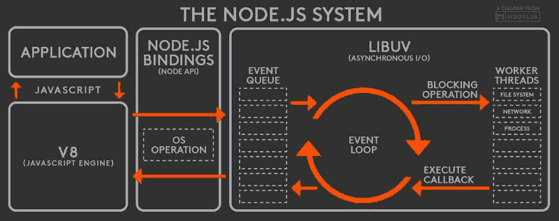
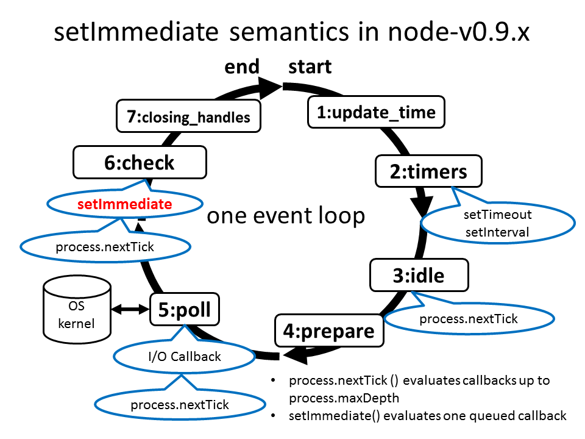

# {{$page.title}}

## 时间并发模型

JavaScript 的并发模型基于"事件循环"。

### 栈

函数调用形成了一个栈帧

### 堆

对象被分配在一个堆中，即用以表示一个大部分非结构化的内存区域

### 队列 

一个 JavaScript 运行时包含了一个待处理的消息队列。每一个消息都有一个为了处理这个消息相关联的函数。

### webapi 中的事件循环

协调用户界面，脚本，渲染，网络等等的事件，用户代理必须使用事件循环作为当前部分的描述，事件循环分为两类：一部分为了浏览上下文，一部分为了workers

一个浏览上下文事件模型总是需要至少一个浏览上下文。如果一个事件循环的浏览上下文结束，那么这个事件循环也随之结束。浏览上下文总是有一个事件循环来协调其活动。

worker 事件循环比较简单：每个worker都有一个事件循环，由worker进程模型管理事件循环的生命周期

一个事件循环有一个或多个任务队列。任务队列是一个有序的任务列表，它负责一下工作的算法：

+ 事件
+ 解析
+ 回调
+ 使用一个资源
+ 响应dom操作

### node 事件处理机制

先看下 node 中的事件处理机制

一个事件循环的时间表

## 事件循环划分

+ Task(macroTask) `script`  `setTimeout`
+ MicroTask `promise` `process.nextTick`  `setImmediate`

先执行 task，后执行 mircoTask。

## 参考

[并发模型与事件循环](https://developer.mozilla.org/zh-CN/docs/Web/JavaScript/EventLoop)

[Tasks, microtasks, queues and schedules](https://jakearchibald.com/2015/tasks-microtasks-queues-and-schedules/)

[The Node.js Event Loop, Timers, and process.nextTick()](https://nodejs.org/en/docs/guides/event-loop-timers-and-nexttick/)

[webapi Event loops](https://html.spec.whatwg.org/multipage/webappapis.html#event-loop)
