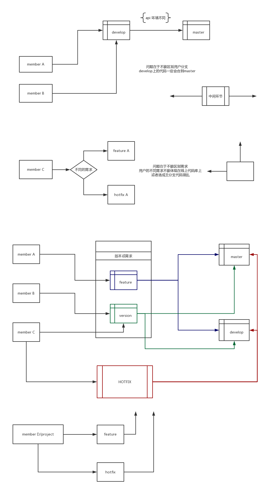

# {{$page.title}}

## 中心化的工作流

中心化的工作流将中央仓库作为项目中所有修改的唯一入口(`master`)，所有更改都被提交到这个分支。

开发者将中央仓库克隆(`clone`)岛本地后开始工作，在本地副本中，修改文件和提交(`commit`)更改，这些新的提交都会保存在本地，我们在开发时可以完全无视上游的开发，直到需要的时候。为了向中心仓库发布修改，开发者需要将本地本质推送(`push`)到中央仓库。

## 解决冲突

当本地代码提交到中央仓库时，如果有其他开发者在你提交之前也提交到了中央仓库，程序先比对代码，如果当两个改动发生在同一个文件的同一些行上，就需要开发者手动解决冲突。`git status` 显示 **both modify**，当我们打开发生冲突的文件内容时，程序会把有问题的区域标记在 `<<<<<<HEAD` 和 `>>>>>>` 内，现在我们需要清理这些问题，过程中，我们可能需要咨询一下和你代码发生冲突的其他开发者，从而更好的决定哪些改动才是最终正确的。

解决冲突时的一些建议：
+ 尽量保持自己与主分支同步，开始开发之前或提交前，拉取中央仓库与之同步。`git fetch` 和 `git rebase`
+ 如果长时间没有与主分支同步，`git rebase` 时会被中断多次，更好的办法是同步主分支后 `git merge`
+ 如果不确定你的同步后的冲突， `--abort` 参数可以放弃合并和变基

## Feature 工作流

在你的开发流程中添加功能分支是一个简单的方式，来促进协作和开发者之间的交流。这种封装使得多个开发者专注自己的功能而不会打扰主代码库。它还保证 master 分支永远不会包含损坏的代码，给持续集成环境带来了是很大的好处。

Feature 分支工作流同样使用中央仓库，master 同样代表官方的项目历史。开发者每次进行新的工作时创建一个新的分支。每个分支都应该有一个清晰、高度集中的目的。开发者可以在 feature 分支上编辑、缓存、提交，feature 分支可以（也应该）被推送到中央仓库，当然，这也是备份每个开发者本地提交的好办法。

## Gitflow 工作流

GitFlow 工作流围绕项目发布定义了一个严格的分支模型。

+ 历史分支
+ 功能分支
+ 发布分支
+ 维护分支

发部分支

维护分支

## Fork 工作流

公开的仓库应该永远是裸的

+ 开发者 fork 仓库
+ 开发者将 fork 的仓库克隆到本地
+ 开发者进行自己的开发
+ 开发者发布他们的功能
+ 项目维护者整合他们的功能
+ 开发者和中央仓库保持同步

## 参考

+ [Comparing Workflows](https://www.atlassian.com/git/tutorials/comparing-workflows)
+ [常见工作流比较](https://github.com/geeeeeeeeek/git-recipes/wiki/3.5-%E5%B8%B8%E8%A7%81%E5%B7%A5%E4%BD%9C%E6%B5%81%E6%AF%94%E8%BE%83)
