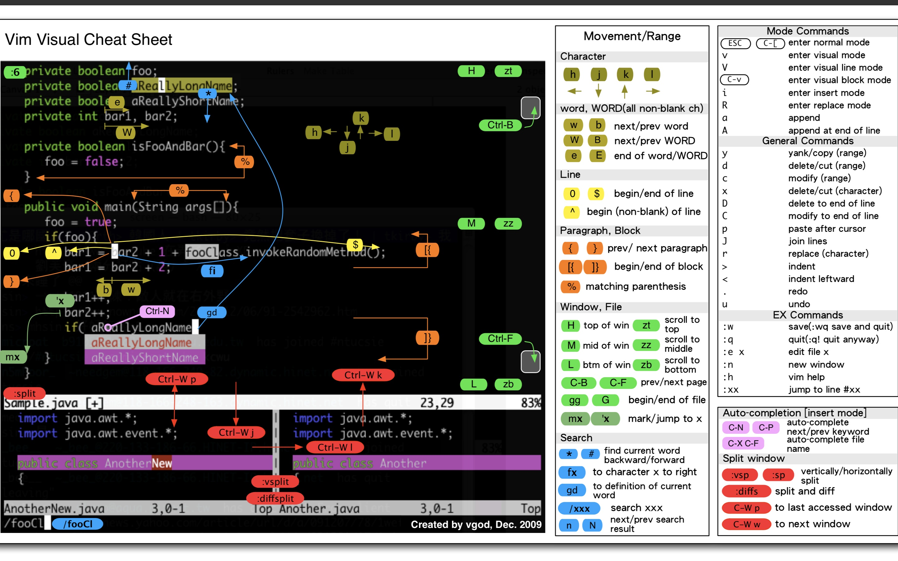

# {{$page.title}}

## 目前最好用的前端编辑器

他妈爱信不信。

学习成本也是非常低，自带中文界面，官方文档完备，社区庞大，扩展齐全，无需设置代理即可访问扩展商店...等等。

用就完了。

## 遇到说vscode不好用的人 怎么在讨论中占据上风

**傻逼 你会用吗？**

## 如何装逼的打开编辑器

`cmd + P` 进入 __快速打开__ 面板, 输入 `>` 搜索系统命令，输入 `code`，选择 __Shell 命令：在 Path 中安装 code 命令__

安装完毕后，即可通过命令行中 `code .` 打开当前文件夹。

## 查看keymap

`ctrl + S ctrl + S`

## 文件操作

+ `cmd + N` 新建文件
+ `cmd + P` 查找文件
+ `cmd + shift + N` 创建新窗口
+ `cmd + S` 保存

基本文件操作 __打开__ __保存__ 够用了。

## 编辑窗口操作

+ `ctrl + Tab` 切换已打开标签
+ `cmd + option + ⬅️➡️` 向左右切换标签
+ `cmd + /` 拆分编辑器
+ `cmd + option + 0` 切换编辑器布局
+ `cmd + 1 2` 切换布局聚焦

窗口切换操作也够用了，主要我也不会了

## 编辑器窗口操作

+ `ctrl + Q` 快速打开面板(不太好用)
+ `cmd + B` 切换侧边栏
+ `ctrl + ~` 切换命令行终端

## 移动操作

⬆️⬇️⬅️➡️

+ `ctrl + P` 上 Previons（我猜的）
+ `ctrl + N` 下 Next（我猜的）
+ `ctrl + B` 上 Backward（我猜的）
+ `ctrl + F` 上 Forward（我猜的）

首尾顶底 cmd + ⬆️⬇️⬅️➡️

+ `ctrl + A` 首 Ahead（我猜的）
+ `ctrl + E` 尾部 End（我猜的）
+ `cmd + ⬆️` 顶
+ `cmd + ⬇️` 底
+ `ctrl + G` 跳行

## 选中

逐字 shift + ⬆️⬇️⬅️➡️

首尾顶底 shift + cmd + ⬆️⬇️⬅️➡️

+ `cmd + D` 选中词，多次使用可向下继续搜索
+ `cmd + option + ⬆️⬇️` 创建多个光标
+ `shift + option + I` 多行选中插入光标

## 可增强改进的keymap

自定义keymap，自己常用操作又不习惯的快捷键可以使用不常用的快捷键来替换。

pagedown pageup 以及移动到顶和底，都需要把手离开键盘区，使用小键盘区域才能完成。

## 使用vim快捷键

安装vim插件，让 vscode 编程 vim 模式

## 参考

+ [简明 VIM 练级攻略](https://coolshell.cn/articles/5426.html)
+ [tips and tricks](https://code.visualstudio.com/docs/getstarted/tips-and-tricks)
