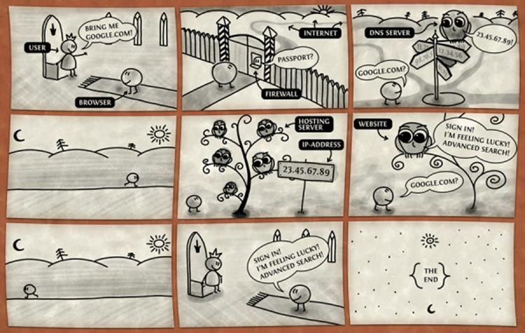
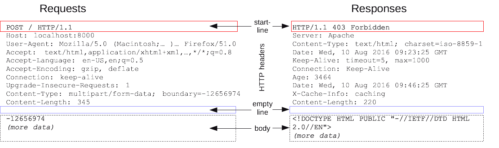
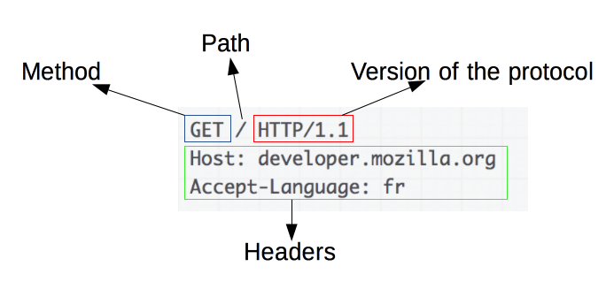
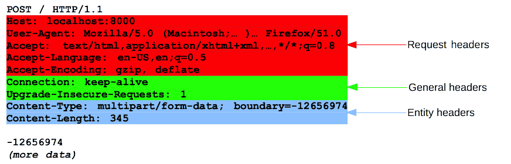
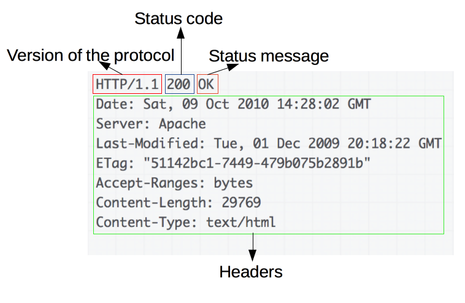
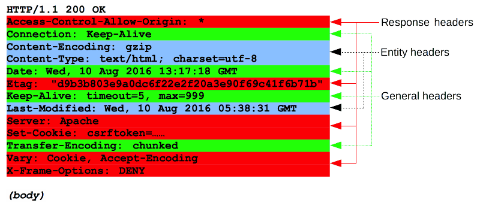
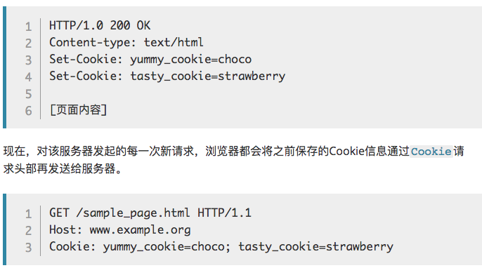

# {{$page.title}}

## How Internet Works

## HTTP 概述

组件系统：客户端、Web 服务器、代理

能控制什么？

缓存、开放同源策略、认证、代理和隧道、会话

## 典型的HTTP会话

会话三个阶段：

1. 客户端建立一条 TCP 连接（如果传输层不是 TCP，也可以是其他适合的连接）。
2. 客户端发送请求并等待应答。
3. 服务器处理请求并送回应答，回应包括一个状态码和对应的数据。

从 HTTP/1.1 开始，连接在完成第三阶段后不再关闭，客户端可以再次发起新的请求。这意味着第二步和第三步可以连续进行数次。

## Resources and URIs

协议://主机:端口/路径?查询#片段

## HTTP消息

HTTP 请求和响应具有相似的结构，由以下部分组成︰
1. 一行起始行用于描述要执行的请求，或者是对应的状态，成功或失败。这个起始行总是单行的。
2. 一个可选的HTTP头集合指明请求或描述消息正文。
3. 一个空行指示所有关于请求的元数据已经发送完毕。
4. 一个可选的包含请求相关数据的正文 (比如HTML表单内容), 或者响应相关的文档。 正文的大小有起始行的HTTP头来指定。

起始行和  HTTP 消息中的HTTP 头统称为请求头，而其有效负载被称为消息正文。

## HTTP报文

### Request

起始行

HTTP请求是由客户端发出的消息，用来使服务器执行动作。起始行 (start-line) 包含三个元素：
1. 一个HTTP方法
2. 请求目标，通常是一个 URL，或者是协议、端口和域名的绝对路径，通常以请求的环境为特征
3. HTTP 版本，定义了剩余报文的结构，作为对期望的响应版本的指示符

Headers

不区分大小写，紧跟着的冒号（':'）和一个结构取决于 header 的值

Body

Body 大致可分为两类：
1. Single-resource bodies，由一个单文件组成。该类型 body 由两个 header 定义： Content-Type 和 Content-Length.
2. Multiple-resource bodies，由多部分 body 组成，每一部分包含不同的信息位。通常是和  HTML Forms 连系在一起。

### Response

起始行

HTTP 响应的起始行被称作 状态行 (status line)，包含以下信息：
1. 协议版本
2. 状态码
3. 状态文本

Headers

Body

Body 大致可分为三类：
1. Single-resource bodies，由已知长度的单个文件组成。该类型 body 由两个 header 定义：Content-Type 和 Content-Length。
2. Single-resource bodies，由未知长度的单个文件组成，通过将 Transfer-Encoding设置为 chunked 来使用 chunks 编码。
3. Multiple-resource bodies，由多部分 body 组成，每部分包含不同的信息段。但这是比较少见的。

## CORS

当一个资源从与该资源本身所在的服务器不同的域或端口请求一个资源时，资源会发起一个跨域 HTTP 请求。
跨域资源共享[（ CORS ）](https://developer.mozilla.org/en-US/docs/Glossary/CORS) 机制允许 Web 应用服务器进行跨域访问控制，从而使跨域数据传输得以安全进行。

### 概述

跨域资源共享标准新增了一组 HTTP 首部字段，允许服务器声明哪些源站有权限访问哪些资源。另外，规范要求，对那些可能对服务器数据产生副作用的 HTTP 请求方法（特别是 GET 以外的 HTTP 请求，或者搭配某些 MIME 类型的 POST 请求），浏览器必须首先使用 OPTIONS 方法发起一个预检请求（preflight request），从而获知服务端是否允许该跨域请求。服务器确认允许之后，才发起实际的 HTTP 请求。在预检请求的返回中，服务器端也可以通知客户端，是否需要携带身份凭证（包括 Cookies 和 HTTP 认证相关数据）。

### 简单请求

某些请求不会触发 CORS 预检请求。本文称这样的请求为“简单请求”，请注意，该术语并不属于 Fetch （其中定义了 CORS）规范。若请求满足所有下述条件，则该请求可视为“简单请求”：

使用下列方法之一：
+ GET
+ HEAD
+ POST

Fetch 规范定义了对 CORS 安全的首部字段集合，不得人为设置该集合之外的其他首部字段。该集合为：
+ Accept
+ Accept-Language
+ Content-Language
+ Content-Type （需要注意额外的限制）
+ DPR
+ Downlink
+ Save-Data
+ Viewport-Width
+ Width

Content-Type 的值仅限于下列三者之一：
+ text/plain
+ multipart/form-data
+ application/x-www-form-urlencoded

请求中的任意XMLHttpRequestUpload 对象均没有注册任何事件监听器；XMLHttpRequestUpload 对象可以使用XMLHttpRequest.upload 属性访问。

请求中没有使用 ReadableStream 对象。

### 预检请求

## Cookies

创建Cookie

### 持久性Cookie

Set-Cookie: id=a3fWa; Expires=Wed, 21 Oct 2015 07:28:00 GMT;

### Cookies的 Secure 和 HttpOnly 标记

### Cookie的作用域

Domain 和 Path 标识定义了Cookie的作用域：即Cookie应该发送给哪些URL。

Domain 标识指定了哪些主机可以接受Cookie。如果不指定，默认为当前文档的主机（不包含子域名）。如果指定了Domain，则一般包含子域名。

Path 标识指定了主机下的哪些路径可以接受Cookie（该URL路径必须存在于请求URL中）。以字符 %x2F ("/") 作为路径分隔符，子路径也会被匹配。

## 参考

+ [TCP/IP 三次握手](https://github.com/jawil/blog/issues/14)
+ [MDN http](https://developer.mozilla.org/zh-CN/docs/Web/HTTP)
+ [TCP/IP协议族](https://zh.wikipedia.org/wiki/TCP/IP%E5%8D%8F%E8%AE%AE%E6%97%8F)
+ [CORS](https://developer.mozilla.org/zh-CN/docs/Web/HTTP/Access_control_CORS)
+ [http状态码](https://zh.wikipedia.org/wiki/HTTP%E7%8A%B6%E6%80%81%E7%A0%81#1xx%E6%B6%88%E6%81%AF)
