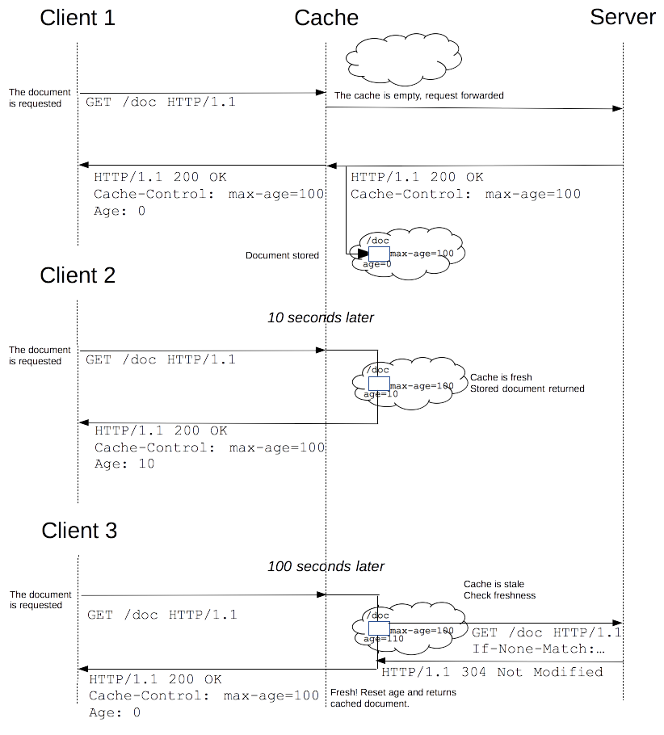

# {{$page.title}}

源所用Web 缓存能够减少延迟与网络阻塞，进而减少显示某个资的时间

作用：
+ 减少网络带宽消耗
+ 降低服务器压力
+ 减少网络延迟，加快页面打开速度

### 缓存类型

（私有）浏览器缓存，（共享）代理缓存

+ 服务器缓存 代理 CDN
+ 浏览器缓存

### 缓存规则

对于浏览器端的缓存来讲，这些规则是在HTTP协议头和HTML页面的Meta标签中定义的。他们分别从新鲜度和缓存验证两个维度来规定浏览器是否可以直接使用缓存中的副本，还是需要去源服务器获取更新的版本。

新鲜度（过期机制）：也就是缓存副本有效期。一个缓存副本必须满足以下条件，浏览器会认为它是有效的，足够新的：

+ 含有完整的过期时间控制头信息（HTTP协议报头），并且仍在有效期内；
+ 浏览器已经使用过这个缓存副本，并且在一个会话中已经检查过新鲜度；

满足以上两个情况的一种，浏览器会直接从缓存中获取副本并渲染。

当客户端发起一个请求时，缓存检索到已有一个对应的陈旧资源（缓存副本），则缓存会先将此请求附加一个If-None-Match头，然后发给目标服务器，以此来检查该资源副本是否是依然还是算新鲜的，若服务器返回了 304 (Not Modified)（该响应不会有带有实体信息），则表示此资源副本是新鲜的，这样一来，可以节省一些带宽。若服务器通过 If-None-Match 或 If-Modified-Since判断后发现已过期，那么会带有该资源的实体内容返回。

当客户端发起一个请求时，缓存检索到已有一个对应的陈旧资源（缓存副本），则缓存会先将此请求附加一个If-None-Match头，然后发给目标服务器，以此来检查该资源副本是否是依然还是算新鲜的，若服务器返回了 304 (Not Modified)（该响应不会有带有实体信息），则表示此资源副本是新鲜的，这样一来，可以节省一些带宽。若服务器通过 If-None-Match 或 If-Modified-Since判断后发现已过期，那么会带有该资源的实体内容返回。

缓存验证：服务器返回资源的时候有时在控制头信息带上这个资源的实体标签Etag（Entity Tag），它可以用来作为浏览器再次请求过程的校验标识。如过发现校验标识不匹配，说明资源已经被修改或过期，浏览器需求重新获取资源内容。

### ETags

如果资源请求的响应头里含有ETag, 客户端可以在后续的所有请求的头中带上 If-None-Match 头来验证缓存。

Last-Modified 响应头可以作为一种弱校验器。说它弱是因为它是一次性的。如果响应头里含有这个信息，客户端可以在后续的一次请求中带上 If-Modified-Since 来验证缓存。

## 比较

|规则 | Header | 值 | 类型 | 作用 |
---- | --- | --- | --- | --- |
|新鲜度 | Expires | | res | 在过期时间前可以使用副本
|    | Pragma | no-cache | res | 忽略缓存的副本
|    | Cache-Control | no-cache | res | 忽略缓存的副本
|    |  | no-store | res | 不保留任何副本
|    |  | max-age | res | 指明有效时长
|    |  | public | res | 任何途径的缓存者（本地，代理），可以无条件的缓存该目标
|    |  | private | res | 只针对单个用户或实体（不同用户，窗口）缓存资源
|    | Last-Modified | | res | 告知浏览器当前资源的最后修改时间
|    | If-Modified-Since | | req | 同 If-None-Match
|验证 | ETag | | res | 告知服务器当前资源在服务器的唯一标识符（生成规则由服务器决定）
|    | If-None-Match | | req | 如果浏览器第一次请求时响应中ETag非空，第二次请求同一资源时，会把它作为该项的值发给服务器
|辅助 | Vary | Accept-Encoding | res | 辅助多个缓存副本中筛选合适的版本（不同压缩算法产生的副本）

### Cache-Control 与 Expires

Cache-Control 有效期为标准，控制浏览器是否从缓存中获取资源还是从服务器重新请求，优先级高于Expires，选项更多。

### Last-Modified/ETag 与 Cache-Control/Expires

Last-Modified/ETag 浏览器再次访问资源，还是会发起一次请求到服务器询问文件是否修改，如果没有，服务器返回304，浏览器就会从缓存中返回数据。如果修改就从服务器返回资源。

Cache-Control/Expires 的优先级要高于 Last-Modified/ETag，如果缓存在有效期内，那么就不会发送请求。

### Last-Modified 与 ETag

服务器会优先验证 ETag

Etag 解决 Last-Modified 的问题：
+ 秒内同时修改，但依然读取缓存
+ 文件定时生成，时间修改，但内容没变，但是没有使用缓存
+ 代理服务器与服务器时间不一致

## 用户操作行为与缓存

**正常重新加载**是强制拉取服务器资源，绕过浏览器的 Cache-Control 与 Expires 判断，依然使用 Last-Modified 与 ETag

**强制重新加载**是强制获取服务器资源。

## 参考
+ [HTTP 缓存 - MDN](https://developer.mozilla.org/zh-CN/docs/Web/HTTP/Caching_FAQ)
+ [HTTP 缓存 - Google](https://developers.google.com/web/fundamentals/performance/optimizing-content-efficiency/http-caching?hl=zh-cn#cache-control_1)
