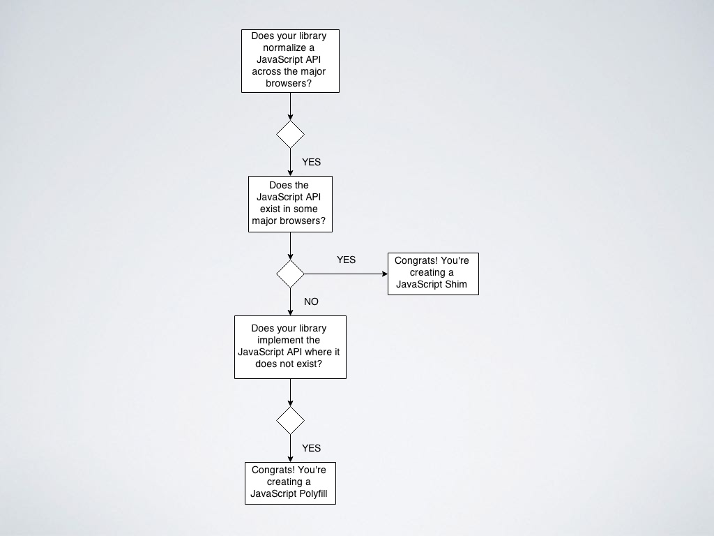

## 什么是 Babel

Babel 是一个工具链，主要用于将 ECMA2015+ 代码转换为向后兼容版本的 JS 代码。

- 转换语法
- Polyfill 实现目标环境中的缺少功能（通过 `@babel/polyfill`)
- 源代码转换（codemods）

### @babel/core

Babel 的核心功能提供。

例：代码转换 AST

```js
var babel = require('@babel/core')
babel.transform(code, options, function (err, result) {
  result // => { code, map, ast }
})
```

### @babel/cli

Babel 内置的 CLI，通过命令行来编译文件。允许你通过终端使用 babel 的工具

例：编译 `./src` 至 `./build`

```bash
babel src --out-dir build
```

### Plugins 和 Presets

使用 `@babel/plugin-transform-arrow-functions` 将箭头函数转换为兼容的函数表达式

但是如果要列举想使用的所有新功能，可以使用 “preset”(`@babel/preset-env`) 来替代一组插件。

## Polyfill

`@babel/polyfill` 模块包括 `core-js` 和自定义 `regenerator runtime` 来模拟完整的 ES2015+ 环境。

- core-js 提供 ES5 ES6 ES7 等规范中新定义的对象和方法的模拟实现。
- regenerator 提供 regenerator 函数支持

### core-js

```js
require('core-js/fn/set')
new Set()

const Map = require('core-js/library/fn/map')
```

当使用 `env` present 时，其中有一个 `"useBuiltIns"` 选项，用于配置引入的 `polyfill`

```js
presets: [
  [
    'env',
    {
      useBuiltIns: 'entry',
    },
  ],
]
```

`"useBuiltIns"` 参数的区别在于，'entry' 在入口中加入 polyfill, 等于 `import 'polyfill'`, 而 'usage' 会根据你所使用的新 API 引入对应的 polyfill。

## Babel 总结

我们使用 `@babel/cli` 从终端运行 Babel，`@babel/polyfill` 来实现所有新的 JavaScript 功能，`env` preset 只包含我们使用的功能的转换，实现我们的目标浏览器中缺少的功能。

## shim 和 polyfill 的区别

- shim 是指仅靠已有环境中存在的 API 模拟出一个新的 API，以便所有环境都具有相同的行为。
- polyfill 是一个浏览器 API 的 shim。polyfill 允许 web 开发人员使用 API，而不管浏览器是否支持它。

[shim](<https://zh.wikipedia.org/wiki/%E5%9E%AB%E7%89%87_(%E7%A8%8B%E5%BA%8F%E8%AE%BE%E8%AE%A1)>) 和 polyfill 是程序设计中的概念，并不是 JS 中独有的概念。

在 JS 中 shim 与 polyfill 的区别在于创建的 API 是否在高级的浏览器中已经存在，如果存在那么就是 shim，否则是 polyfill。



还有一种说法是，shim 指 ECMAScript 语法，而 polyfill 指 浏览器环境 API。

个人感觉以上说法都可以作为理解的参考，并不一定要有 100%准确的答案

## 看一个使用的例子

```js
class MyApp {
    async load() {
        const data = await fetch('data')
    }
}

npm i -D @babel/core @babel/preset-env
```

上面的代码片段是 👍

```js
const set = new Set()
const obj = Object.freeze(x)
const user = Reflect.construct(User, args)
Array.from(nodes)

// Uncaught ReferenceError: Map is not defined

// Uncaught TypeError: Object.freeze is not a function

// Uncaught ReferenceError: Reflect is not defined
```

但这里的代码片段是 👎

**Transpiling != Polyfilling**

> Transpilers are also known as source-to-source compilers. So in essence they are a subset of compilers which take in a source code file and convert it to another source code file in some other language or a different version of the same language. The ouput is generally understandable by a human. This output still has to go through a compiler or interpreter to be able to run on the machine.

Transpiling = new syntax

Polyfilling = new API

加入 polyfill

```
npm i -D @babel/polyfill
```

```js
fetch('/user')
imageCapture = new ImageCapture(track)
const myRequest = new Request('user.jpg')
const searchParams = new URLSearchParams(paramsString)

// Uncaught ReferenceError: fetch is not defined
```

**Javascript API != Browser API**

Browser API: https://caniuse.com

Javascript API: https://kangax.github.io/compat-table/es6/

```
npm i whatwg-fetch
npm i image-capture
npm i classlist.js
```

👍

编辑器中获取兼容性检查：

[eslint-plugin-compat](https://www.npmjs.com/package/eslint-plugin-compat)

### polyfill.io

polyfill.io 允许你使用查询参数，判断当前浏览器环境是否需要加入 polyfill。

```js
var features = []
'Promise' in window || features.push('Promise')
```

你需要追踪所使用的所有特性，默认情况下脚本会异步的添加到文档中，然后浏览器会执行脚本，并向 polyfill.io 请求所需要的特性

### bundle-utils

提供一个针对不同浏览器兼容的打包策略

### 参考

- [99 ways to take away your ugly polyfills](https://www.slideshare.net/fwdays/artem-yavorsky-99-ways-to-take-away-your-ugly-polyfills)
- [What is the difference between a shim and a polyfill?](https://stackoverflow.com/questions/6599815/what-is-the-difference-between-a-shim-and-a-polyfill)
- [使用指南 Babel](https://babel.docschina.org)
