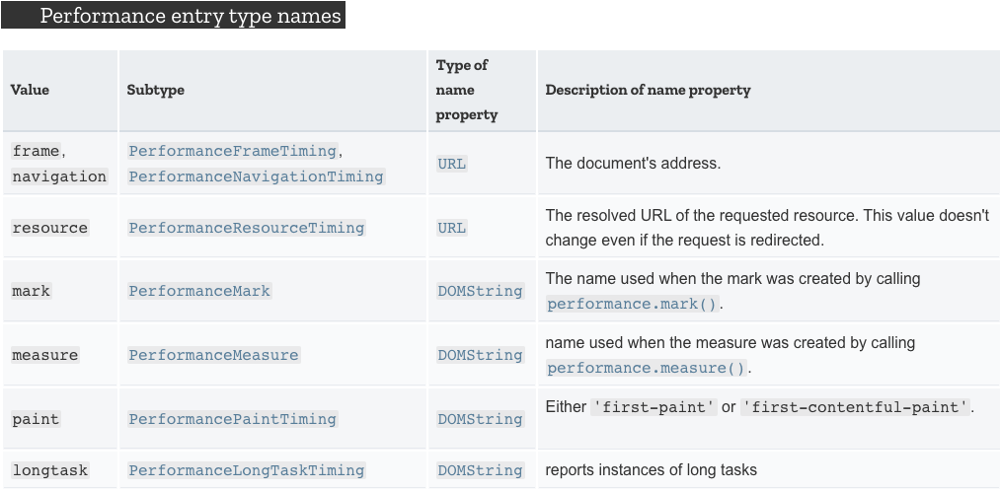
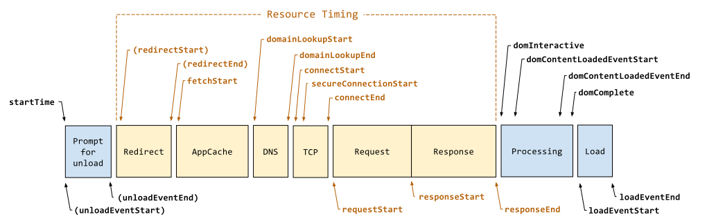
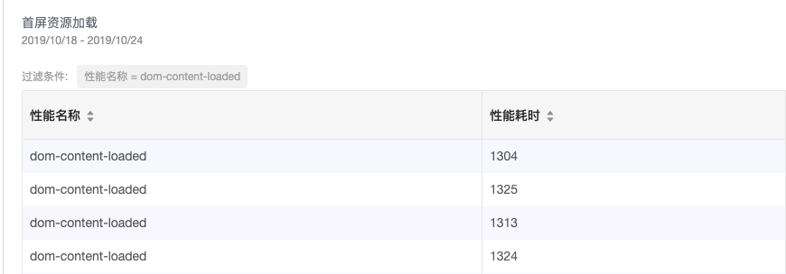

# {{$page.title}}

## 关于前端性能评测的意义

从业务角度上，性能提升对于用户体验和转化率的提升。从技术角度上，针对项目上的优化需要量化，需要诊断和分析。

从用户出发，你非常能理解对于一个访问性较差的网站，你的容忍度是取决于你的需求和是否有替代网站。但技术角度上，为什么需要量化性能？当你在通过各种技术和经验优化一个网站时，如果你没法通过前后的数据来对比结果，紧靠感知上很难说明你的优化是否有效。而且多数优化手段通过工具，仅能从通用角度来告诉你优化的手段，但无法让你从用户角度出发来体验你的网站，工具并未在用户设备上运行，因此未反映出用户的实际性能体验。

主观上的快和慢，无法让我们具体定位到技术上，而且主观上响应的时间并不代表页面完成加载时间，可以利用骨架图，PWA 的 APP 骨架，渲染主要路径的 CSS 和 DOM 这样让用户体验时间加快。

## 使用 Performance API

我们可以通过浏览器新增的 `Performance Timeline` API，在用户端评测一些加载和性能指标，通过这些数据，我们进行分析，然后针对性的优化。

根据 W3C 草案定义的 `Performance Timeline Level 2`，我们可以接收关于用户行为、资源请求、渲染等耗时任务的通知。通过 `PerformanceObserver`, `PerformanceEntry` API，订阅相关类型的耗时通知，类型如下表([MDN](https://developer.mozilla.org/en-US/docs/Web/API/PerformanceEntry/entryType))



- navigation 包含从文档进入到结束的性能指标。定义描述： [`PerformanceNavigationTiming`](https://www.w3.org/TR/navigation-timing-2/#dom-performancenavigationtiming)
- resource 资源的耗时。定义描述： [`PerformanceResourceTiming`](https://www.w3.org/TR/resource-timing-2/)
- mark, measure 调用 `performance.mark()` `performance.measure()`时时候
- paint 渲染相关
- longtask 主用户界面线程忙碌 50 毫秒或更长时间的任何不间断时段，[MDN](https://developer.mozilla.org/en-US/docs/Web/API/Long_Tasks_API)

下面通过一张图来了解一下，发生在浏览器中的加载过程模型



这样某些指标就非常容易计算，比如

```js

dns 查询时间 = timing.domainLookupEnd - timing.domainLookupStart
dns 缓存时间 = timing.domainLookupStart - timing.fetchStart
tcp 链接耗时 = timing.connectEnd - timing.connectStart
请求耗时 = timing.responseEnd - timing.responseStart
...

```

## 已用户为中心的性能指标

从用户的非专业角度，网站速度是否够快，发生于输入 URL 敲击回车后，白屏到第一个元素的显示，然后到视觉上的所有内容显示，以及已显示出内容是否可以交互。从技术上，后端渲染的页面非常好理解，当 HTML 文档请求结束到 DOM 渲染前是白屏时间。当 CSSOM 和 DOM 构建渲染结束就是文档渲染结束。当所有资源请求结束就是可交互时间。但 SPA 页面就不大相同，SPA 依赖于主要入口 js (main.js) 请求加载后，白屏时间是在 main.js 加载后的渲染动作后，而且很可能还要依赖于所需渲染数据完成之后。那么白屏时间就是页面请求开始到框架挂在 DOM 元素被插入内容之后的时间。首屏时间就很可能是你接口数据请求之后。所以这些指标需要我们根据实际的场景进行计算。

衡量用户性能的指标

| 体验           | 实际场景                                   | 指标                                           |
| -------------- | ------------------------------------------ | ---------------------------------------------- |
| 是否发生？     | 导航是否成功启动？服务器是否有响应？       | 首次绘制 (FP)/首次内容绘制 (FCP)               |
| 是否有用？     | 是否已渲染可以与用户互动的足够内容？       | 首次有效绘制 (FMP)/主角元素计时                |
| 是否可用？     | 用户可以与页面交互，还是页面仍在忙于加载？ | 可交互时间 (TTI)                               |
| 是否令人愉快？ | 交互是否顺畅而自然，没有滞后和卡顿？       | 耗时较长的任务（在技术上不存在耗时较长的任务） |

首次绘制与首次内容绘制的区别在于 浏览器渲染来自 DOM 第一位内容（文本 图形 SVG 或 `<canvas>`）的时间点。

## 数据采集

可以使用图片请求附带参数, 这样错误不影响业务逻辑，也不存在跨域问题

```html

```

或使用 [`window.navigator.sendBeacon`](https://developer.mozilla.org/zh-CN/docs/Web/API/Navigator/sendBeacon) 发送数据

```js
navigator.sendBeacon("/log", {
  startTime: 6,
  duration: 100
});
```

配合采集日志使用，例如：阿里云的采集服务（[Web Tracking](https://help.aliyun.com/document_detail/31752.html))，使用 阿里云对象储存的[日志](https://help.aliyun.com/document_detail/99349.html)等方式。

配合数据埋点服务使用，比如 谷歌统计，growingio，配合自定义事件埋点，来发送数据。

## 代码示例

我们简单的上报时间，"首次渲染",”首次内容渲染“以及”dom 加载完成“，这里并没有做 FMP 等用户角度的测量维度。

```js
const observer = new PerformanceObserver(list => {
  for (const entry of list.getEntries()) {
    const metricName =
      entry.entryType === "navigation" ? "dom-content-loaded" : entry.name;
    const time = Math.round(entry.startTime + entry.duration);
    gio("track", "PERFORMANCE_METRIC", {
      performance_duration: time,
      performance_entryType: metricName
    });
  }
});
observer.observe({
  entryTypes: ["paint", "navigation"]
});
```

这里是效果，也并没有详细的统计数据，只是简单的展示。



### 参考

- [以用户为中心的性能指标](https://developers.google.com/web/fundamentals/performance/user-centric-performance-metrics)
- [Navigation Timing Level 2](https://www.w3.org/TR/navigation-timing-2/)
- [Understading Resource Timing](https://developers.google.com/web/tools/chrome-devtools/network/understanding-resource-timing)
