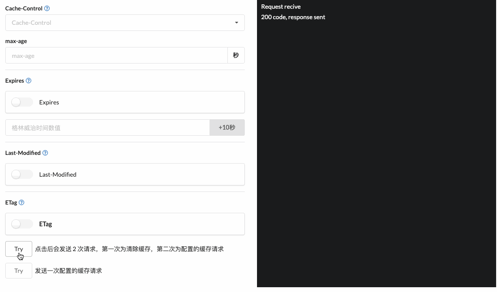

# {{$page.title}}

## 剪辑版

**浏览器通过请求头 `Cache-Control` 来控制是否使用缓存资源，通过 `ETag` 来验证缓存是否可用。**

只要保证想要缓存的资源有这两个请求头，并且符合自己想要的策略，就可以覆盖大多数场景了。

## FBI WARNING

下面是对于一句话的简单解释：

对于不想缓存的资源，可以使用 _no-store_ (不存储)， _no-cache_ (不使用)

对于想缓存的资源，使用 _max-age_ 来控制缓存的寿命（单位秒），只要缓存在有效期内，那么获取资源就会使用缓存的副本，返回的状态为 _200 from disk_ 或 _200 from memory_，因为资源是从缓存中获取，所以并没有发起网络请求。

如果缓存已经过期，客户端发起请求时，会携带一个 `If-None-Match` 的头发送给服务器，对资源的缓存进行一次检索。如果文件没有改变，那么返回 304，这样就不用把响应体发送回来了，顺便更新一下缓存的新鲜度。如果文件改动了，那么就把资源重新返回。

下面是废话：

缓存优先级 `Cache-Control` > `Expires` > `Last-Modified`

验证优先级 `ETag` > `Last-Modified`

`ETag` 发起 `If-None-Match`， `Last-Modified` 发起 `If-Modified-Since`

一般情况下不会用到 `Cache-Control` 的代理和重新验证的几个属性，遇到的时候想到就好。

深入的重点：

关于缓存验证，新鲜度，直接看下面的番号吧。对于缓存相关请求头的详细信息，请直接查阅 MDN。别人说的再多也不如自己从规范中理解和总结。

重中之重：

学知识上 **MDN** 和 **谷歌开发者社区**。

## 资源番号

- [HTTP 缓存 - MDN](https://developer.mozilla.org/zh-CN/docs/Web/HTTP/Caching_FAQ)
- [HTTP 缓存 - 谷歌开发者社区](https://developers.google.com/web/fundamentals/performance/optimizing-content-efficiency/http-caching?hl=zh-CN)

## 自己动手 丰衣足食

写了一个小工具，来帮助大家熟悉这几个请求头的概念



Github 地址: [http-cache-learn](https://github.com/KennyWho/http-cache-learn)

编码不易，感谢大家素质三连。
