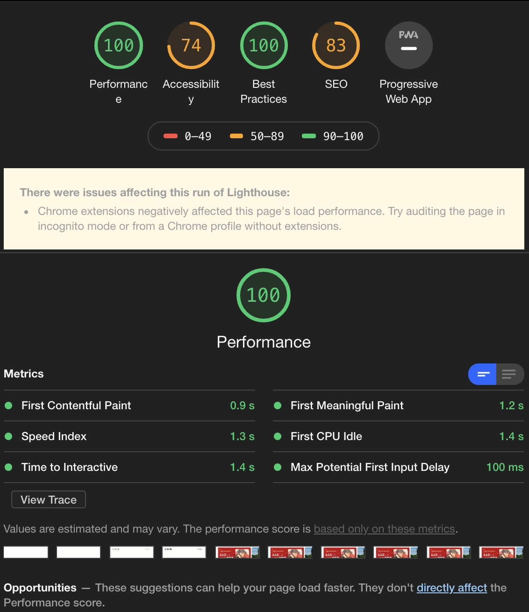

# {{$page.title}}

用一句今年的流行语形容我的 2019 最确切不过 “**我太难了**”。

## 工作

上半年在前公司还在做管理培训，下半年裁员就落在我头上。被动让我换了一次工作，主动求职是没有被动时更容易找到合适和满意的工作，首先在心态上，你在一段时间内找不到工作就会降低要求，而你在被动求职时，是选择更好的工作。

好在，找到了一个虽然薪资远不如上一家公司，但是上级还算认可我个人能力的公司。上级和 CTO 都是前前同事，很多同事也是一起共事过，公司氛围和之前非常相似，所以还算习惯。

通过上家被裁的经验就是，在选择工作前，要考虑职场的上升空间，不应仅仅考虑薪资，很多情况下上级对你是否认可，公司内部的管理结构是否透明顺畅，关系到你后期的发展空间。因为这些方面的考虑不足，以及我本人个性比较鲜明，导致最后被裁员，但是即便不裁我，如果团队内减员到几个人，可能我也主动离职，所以好在还能拿到赔偿，也感谢领导把机会给我。因为上一家的绩效一直拿的很高，所以现在导致的就是收入上的落差，而且之前的公司也很少加班，压力没那么大。

新公司压力会大一点，技术栈对我来说也比较陌生，之前没用过 React，还需要对他们之前的代码进行一点的重构和规范。而且很多时候不光要做技术上的规划，业务上的跟进，人手不够的时候，还要写业务代码。所以投入的时间和精力会更多，很多情况下，会发现自己的精力不够用，做事也是心有余力不足。

## 学习

反正平时也不爱看书，书倒是买了不少，但是一本也没拆，实在没啥精力去系统学习某些技能，基本还是业务上想到了直接找技术文档和规范，回家有精力都玩游戏了。报了个英语专业，确实也没啥精力学，考前磨枪，过不过看天意了。反正一有空就打 Dota2，魔兽怀旧服佛系升到 60 级，然后再也不想上了，曾经热爱的游戏，在生活面前也没了热情。

## 技术

上半年主要技术栈是 Hapi.js + TS 重构 Koa2 项目，Vue 项目的重构和优化。

TS 在 Node 端用了就回不去了，但是很多情况下类型也没有写的非常严格，觉得没太多必要在上面废太多精力和增加成本。Hapi 这框架也是用了就回不去了，Koa 和 Express 对于一个健全的 Web 应用，需要额外的选择太多，分散了很多精力，我宁愿尝试新框架也不愿用自己熟悉的框架做重复的工作。并且在业余时间把 [Hapi 文档](https://github.com/KennyWho/hapi-api-doc-cn) 翻译了一下，算是今年干了点正事。对内部日志服务做了一些调整和跟进，接入了阿里云的日志服务，排查问题时还是比较方便的。

对于 Web H5 项目，今年做了很多优化上的工作。工程方面，因为重构所以直接用了 vue-cli3, 对 Webpack 控制更多一点吧。网络层面是我比较关注的重点，更少的请求数，减小的资源大小，更合适的图片类型，更新的缓存技术。下面罗列几个技术的关注点，就不一一展开了。

- 网络预加载 Prefetch,Preload, [instant.page](https://github.com/instantpage/instant.page), [Quicklink](https://github.com/GoogleChromeLabs/quicklink)
- Webp 图片与对象存储的图片处理。
- web worker, service workers, Workbox
- Lighthouse 工具 和 Performance Api

因为离职的原因，持续优化并没有跟进，但是对于一个商业的单页面应用，这个分数还是 OK.

下半年换了公司和技术栈，而且主要精力也从之前重构代码和优化项目向业务倾斜。但是优化，规范，流程还是要做，对于业务和技术文档的编写，平时的面试等等，负责的事越多，你就发现人的精力真的越有限，很佩服能把所有事情有条不紊的跟进的人，其实这点事我就已经抽不开身了。

以往的工作经验让我发觉，很多程序员做事只管自己职能范围内，并不会主动去推进和延伸，所以导致项目代码没有一个可控性，完全按照每个人自己的习惯和心情写。如果这个项目没有一个指定的管理者或负责人，那么基本这个项目就是随心所欲的发挥了。所以刚开始的重心又变成了规范代码和流程，基础代码重构，这部分比较浪费精力，因为我对 react 完全没有经验，而且这个项目在使用 hooks，又花费了很多精力在理解 hooks 上。这个过程非常不愉快，个人不喜欢技术门槛高的框架，我觉得框架是为了减少思考，最好不思考，概念太多，导致学习成本变高，在能用和用的好这个过程就会变长。人生苦短，用有限的精力去享受生活不好吗？而且对于项目来说，招聘、开发、效率这个成本都被附带的提高。

 在这里做的技术落实和延展。

- 代码提交和流程规范，工作流程中的 eslint + precommit 以及 gitflow 的延展。
- React 项目里预加载和分包策略的优化，加快网络请求的速度，并升级 webpack 4，主要是为了打包性能。
- 性能统计的简单落实，通过数据埋点上报，对用户的性能进行评测。
- CI 流程的优化，减少不必要的任务处理。
- Sentry 的使用度加强，对于 sourcemap 和 CI 流程中的配合，对于线上问题的处理和跟踪。
- 对于前端自动化测试的探索，对于重复工作流程进行自动化。

做的很多优化工作无法量化，所以听起来感觉很虚。比如对于代码上的优化可能是为了减少问题的产生，或者提高可维护性，对于流程上的优化可能是打包和开发编译时间。所以针对优化工作之前，我们一定要把之前的问题表达清楚，做好记录，再与优化后尽量做出量化的对比，这样能确保自己的所花费的时间成本是有意义的。

最后也不给明年立什么 Flag 了，并没有什么卵用。
