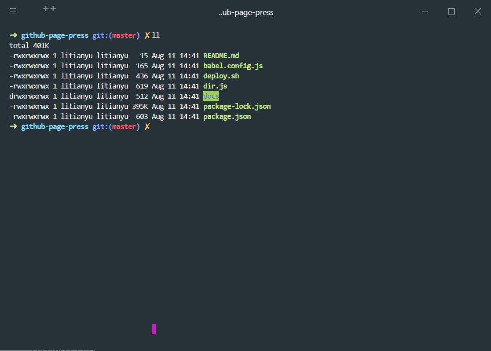
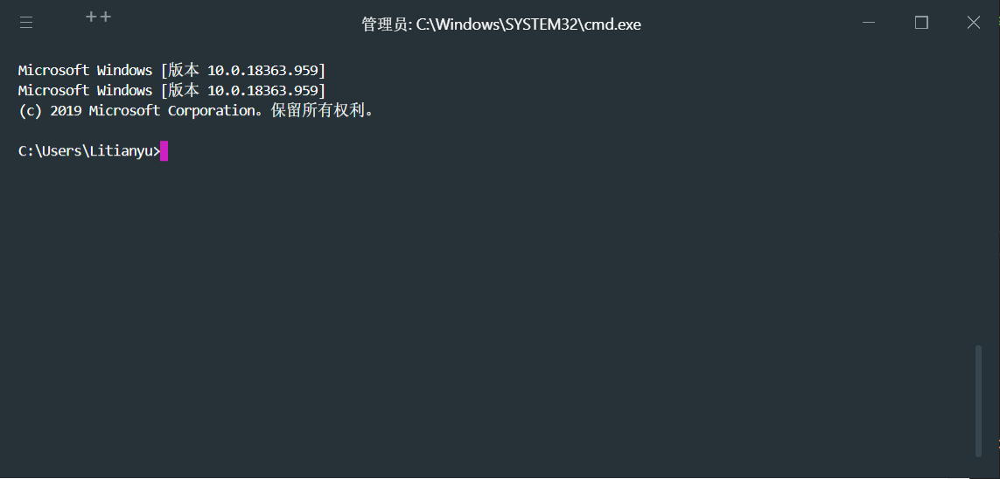

# {{$page.title}}

因为腾讯云的 SDK 不支持跨平台打包，所以需要使用 Windows 系统来打包 Windows 应用，在虚拟机中配置开发环境并不适合长期开发，所以购买了一块 SSD 作为 Windows 系统盘。

### 准备

首先避免引起不必要的权限问题，在创建用户时，要把用户作为管理员身份。

梯子是必须的。

### 安装 WSL

为了更好的使用 node，这里选择使用 WSL 作为运行系统， WSL 是 Windows 环境的 Linux 子系统，这里使用的是 Ubuntu。根据指引 [Windows Subsystem for Linux Installation Guide for Windows 10](https://docs.microsoft.com/en-us/windows/wsl/install-win10) 安装

如果你的 Mircosoft Store 无法打开，请检查你的网络设置中代理是否已经关闭。

在子系统中安装 `zsh` 以及开发环境，通过 `cp` 命令将 Windows 与 Linux 文件互传。

[使用 WSL 2 设置 Node.js 开发环境](https://docs.microsoft.com/zh-cn/windows/nodejs/setup-on-wsl2)

[wsl 使用 windows 命令](https://docs.microsoft.com/zh-cn/windows/wsl/filesystems)

WSL 环境下需要安装语言包来支持 VScode 中文

```bash
sudo apt-get install language-pack-zh-han*
```

### Windows Shells

~~选择 `hyper` 作为主命令行工具， `cmder mini` 作为备用命令行工具。hyper 中集成 cmder 会造成使用界面关闭控制时，会造成程序崩溃，但使用 `exit;` 命令不会，但有时也会习惯性使用界面关闭，所以为了避免这个问题就分离了两个命令行使用。~~

hyper 配置

```js
// 插件
plugins: [
    "hyper-search",
    "hyper-pane",
    "hyper-tabs-enhanced",
    "hyper-launch-menu",
    "hyper-material-theme"
],
// shells 配置
shells: [{
    name: 'cmd',
    shell: 'cmd.exe',
    args: ['--login'],
    default: true
}, {
    name: 'wsl',
    shell: 'wsl.exe',
    args: []
}],
```

WSL 界面



CMD 界面



通过以上配置，我可以在 Windows 环境下使用 Linux 环境和命令行，并且可以在两个系统内自由切换。

关于命令行配置可以参考 [HowTo: My Terminal & Shell setup - Hyper.js + ZSH + starship](https://tjay.dev/howto-my-terminal-shell-setup-hyper-js-zsh-starship/)

ZSH 配置

```bash
# ~/.zshrc

# where proxy
proxy () {
  export http_proxy="http://127.0.0.1:1080"
  export https_proxy="http://127.0.0.1:1080"
  echo "HTTP Proxy on"
}

# where noproxy
unproxy () {
  unset http_proxy
  unset https_proxy
  echo "HTTP Proxy off"
}

# 解决不匹配 * 问题
setopt no_nomatch
```

**目前已经切换为 Windows Terminal 替换 Hyper**

### 开发环境

注意区分 Windows 环境和 WSL 环境

- Node NVM NRM

### 工具

- 窗口管理工具： [PowerToys](https://github.com/microsoft/PowerToys)
- POSTMAN
- Docker

### 数据库

mysql 8.x 安装在 WSL 后，如果遇到无法通过 socket 连接错误，尝试以下命令

```shell
sudo mkdir -p /var/run/mysqld
sudo chown mysql /var/run/mysqld/
sudo service mysql restart
```

设置初始密码，首先找到可登入的系统账户和密码

```shell
sudo cat /etc/mysql/debian.cnf
```

随后修改密码

```shell
ALTER USER 'root'@'localhost' IDENTIFIED WITH mysql_native_password BY '123456';
```
