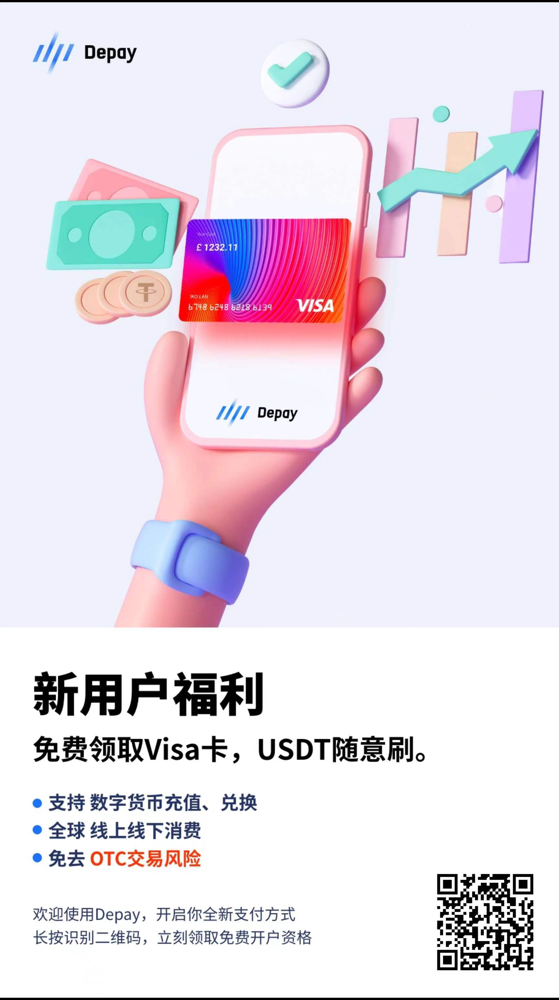

Depay 支持使用 trc20 的 USDT 兑换 USD，最基本的卡，充值手续费 1.35%(最低 1 USD)，月费 2 USD，可以绑定支付宝。支持互相使用 Depay 转账，还可以虚拟 VISA MASTERCARD 进行海外消费。

安卓直接从官网下载 APK 安装。

从币安交易所使用 trc20 转账到 Depay 的充值地址，手续费是 1 USD，时间 < 5 mins, 实际大约在 1 min 左右。建议随用随充，避免资金风险。

申请卡片，免费的需要 KYC，免 KYC 需要 付费 10 USD。

从钱包向卡内充值手续费根据卡的不同是不同的费率，我是 1.38%(min 1 USD)。

可以使用微信，支付宝等添加信用卡，在 Depay 中 CVV 安全码复制信用卡信息（不要泄露安全码），绑定后就可以在其他支付场景使用信用卡了，汇率是实时的。

附上我的邀请码 [`802957`](https://depay.depay.one/web-app/register-h5?invitCode=802957&lang=zh-cn)，通过我邀请码的可以帮忙充值。

尝试了一些支付场景，滴滴打车 711 购买 拼多多网购 商家支付码，都是没问题的。

## FAQ

Q: kyc 身份认证

> 上传身份证和认证后开卡 10 分钟后系统自动审核;  
> Lite 卡 10 USDT，免 KYC 身份认证

Q: 充值

> 使用交易所或链上向 depay 的充值地址进行划转（充值），选择对应的链，目前支持 BEP(币安)和 TRC20(波场)，转账后将 USDT 兑换为 USD，再将 USD 充值进自己的信用卡。

Q: 兑换

> 将 USDT 转换为美元(USD)，充值进卡内才可以使用。当前汇率大约为 1USDT = 0.9999UDD

Q: 如何获取 Depay ID

> APP 底部导航栏 -【我的】- 左上角复制【DP+数字】

Q: cvv 安全码

> CVV 安全码是信用卡上的三位数字，通常在信用卡背面签名区域右侧。这是信用卡安全的重要组成部分，用于在线或电话购物时进行身份验证。  
> **不要像陌生人泄露，注意交易安全，切勿截图发送**  
> 查看 CVV 在 APP 首页，信用卡下方 【CVV 安全码】点击查看。  
> 信用卡有效期格式为 MM/YY 如果 03/26 代表 26 年 3 月。

Q: 什么是内部转账

> 通过 depay id 或者手机号进行无费率的快速钱包转账，仅支持钱包余额。

Q: 什么是 OTC

> OTC 是场外交易（Over-The-Counter），是指在交易所之外，由交易双方直接进行的交易。在数字货币领域，OTC 通常是指在交易所之外，由个人或机构直接进行的数字货币交易。相对于在交易所内进行的交易，OTC 交易更加私密，具有更高的自由度和灵活性，但是风险也更加高。

Q: 什么是交易所

> 交易所是数字货币交易的平台，类似于股票交易所。用户可以在交易所上买入和卖出数字货币。有些交易所允许使用法币进行购买，也有一些只支持数字货币之间的交易。用户需要在交易所上注册账号并完成身份认证才能开始交易。  
> 推荐使用币安和 OK 交易所

Q: 如何获取 USDT

> 通过交易所进行 OTC 交易，但是会有交易限制，新注册用户可能需要次日才能交易，可以在群内进行 depay 内部转账。

Q: 有推荐的 VPN 机场 代理吗？

> https://blog.x-ray.work/blogs/2023-03-18-ladder.html
