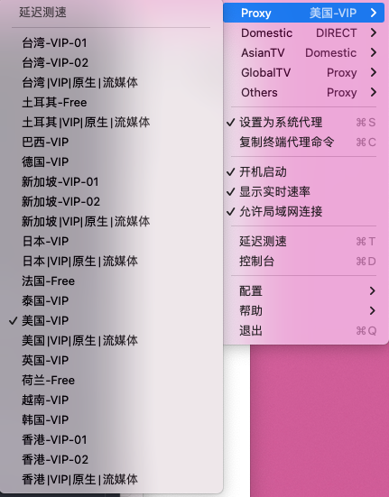
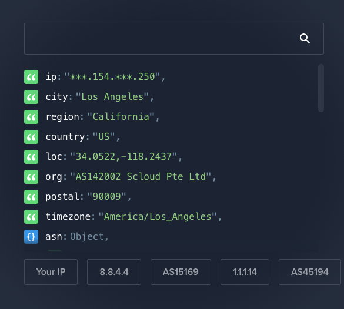
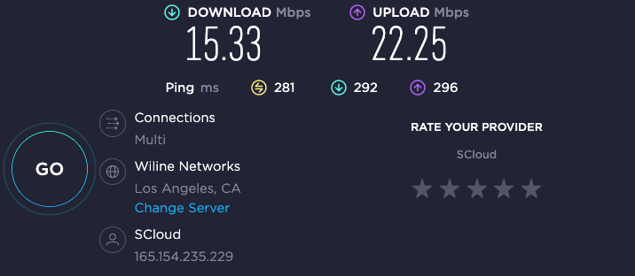

因为 monocloud 的邀请码需要 14 天才可以邀请一人，所以新人想使用稳定的代理需要代购，比较麻烦。这里推荐我在使用的另一个 VPN。

如果你正在寻找一个价格便宜、流量不限制、稳定代理的梯子，那么我推荐 [PureFast](https://purefast.net/auth/register?code=LKZx)。这款代理服务还提供每日签到，可以获得 24 小时的免费节点。与其他代理服务相比，PureFast 更加方便快捷，而且价格实惠，最便宜的套餐仅 13.5/月。无论你是需要使用代理访问被封锁的网站，还是需要保护个人隐私，PureFast 都是一个不错的选择。

PureFast 的注册过程非常简单，你只需要使用我的邀请码 [https://purefast.net/auth/register?code=LKZx](https://purefast.net/auth/register?code=LKZx) 进行注册即可。注册之后，你可以选择购买不同套餐的会员，根据自己的需求选择合适的套餐即可。PureFast 提供了多种付款方式，支付宝、微信等都可以使用。

关于 PureFast 的节点分布，它在全球范围内都有节点，包括美国、欧洲、亚洲等地。这意味着无论你身在哪个国家，都可以享受到 PureFast 提供的服务。并且带有流媒体节点，可以在奈飞等限制地域的视频网站使用。

如果你有任何疑问或者需要帮助，可以随时联系 PureFast 的客服团队，他们会为你提供专业的技术支持和解决方案。总的来说，PureFast 是一个非常值得信赖的代理服务，它能够为你带来更加安全、自由的互联网体验。

这里我购买了最便宜的套餐 ￥ 13.5/月，不限制流量，限速 15M，但是观看视频还是很流程的，下面是我的测试。purefast 最好的一点是可以看到你所使用的节点正在有多少人一起在线使用，大大降低了开通限制 IP 服务的难度。

使用 speedtest 进行了测速

这里是 youtube 720p 的测试

