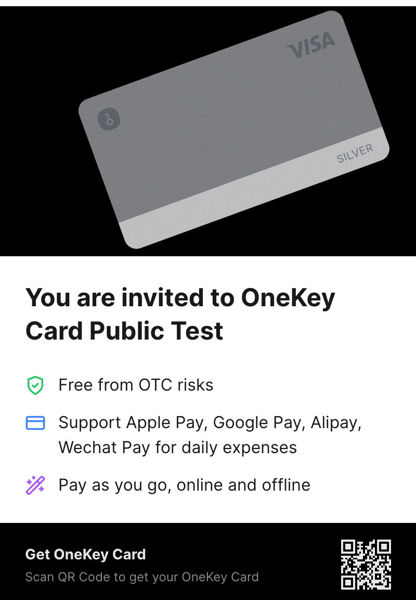
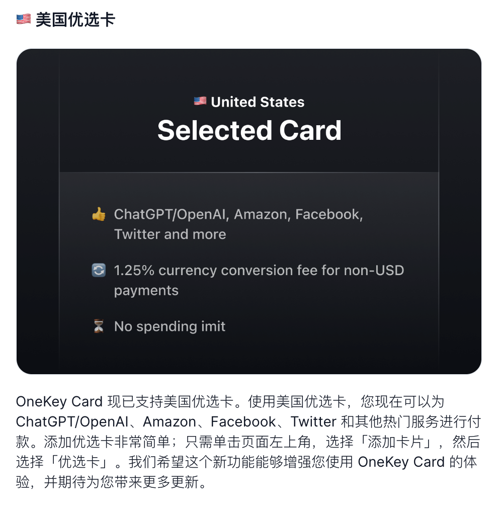
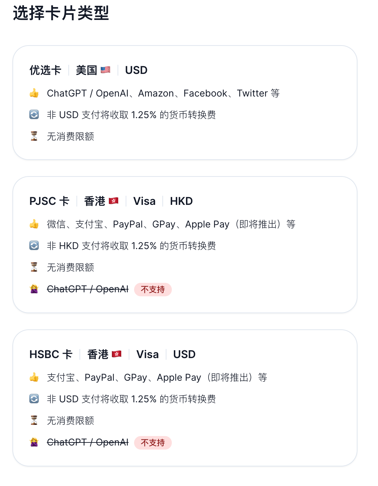

之前推荐过 [depay 的虚拟卡](/2023/02/15/depay/)（已经升级为 dupay），因为使用中暂停过过充值，所以就把所有钱都提出来了。也就没有去找其他替代品，期间也知道过 OneKey 也开放了 Beta 的测试，但是没有第一时间使用，昨天也是闲来无事就把卡开了. OneKey Card 相比其他虚拟卡更具有认可度，因为公司本身是做硬件钱包的，个人认为要比单纯没有背书直接就做虚拟卡业务要更靠谱。

目前处于 Beta 阶段，所以注册后需要邀请码，这里可以使用我的邀请码 [VVELES](https://card.onekey.so/?i=VVELES)

支持 ChatGPT 付费的优选卡

他们的应用直接在浏览器访问就可以，移动端友好，无需下载 APP

1. 注册流程就是使用谷歌账号注册，然后输入邀请码
2. 然后进行 KYC
3. 通过后选择你想要的卡片，如果为了 ChatGPT 充值，请选择美国优选卡。
4. 开卡需要链上方式充值 USDC 或 USDT，最少 30 美元。支持很多链，但是不支持 BSC ...

从免费账户（银卡）来说，每月 1 USD，开卡费用 $1，如果你消费的是非支持的币种，需要支付 1.25% 的货币转换费，具体见下

其他问题可以查看 [官方的 OneKey 帮助中心](https://help.onekey.so/hc/zh-cn/sections/6726670572815-OneKey-Card)
