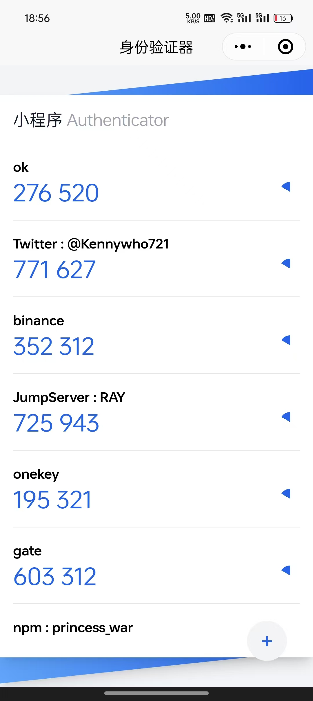

国内某些安卓系统手机无法安装谷歌商店，以及需要科学上网，或者需要下载 Authenticator 的 APK 文件安装，才可以使用动态码。

并且我之前有使用过 `otplib` 写过一个基于[命令行的动态码工具](https://github.com/x-ray-s/2fa-cmd)的经验，所以复刻了一个 Authenticator 的小程序，支持 Authenticator 的**导出二维码**，以及扫描二维码添加动态码。

### 实现

UI 方面直接使用 Cursor AI 对话生成界面，但是使用的是 `uniapp` 的框架，所以需要更改一些代码。因为习惯 `tailwind`，所以使用一个[启动模板](https://github.com/sonofmagic/uni-app-vite-vue3-tailwind-vscode-template)让 uniapp 支持 `tailwind`。生成式 AI 几乎帮我完成了 90% 的界面代码。

使用 `otplib/browser` 来实现 otp 的生成。

支持导入谷歌 Authenticator 的二维码是最浪费时间的部分，因为导出的信息是 `URI` 形式，需要使用 `protobuf` 解析出 secret 和 issuer 还有 label 信息, 要支持 protobuf 解析，需要使用 `protobufjs`，而且需要 static code 而不是 reflection `.proto` 文件。所以需要将 `.proto` 文件静态编译为 `.js` 文件，而且还要解决 js module 的引入问题，这里使用 [protobufjs-cli](https://github.com/protobufjs/protobuf.js/blob/master/cli/README.md) 解决。

附上 [github 仓库](https://github.com/x-ray-s/2fa-mp)

可以扫码体验：

