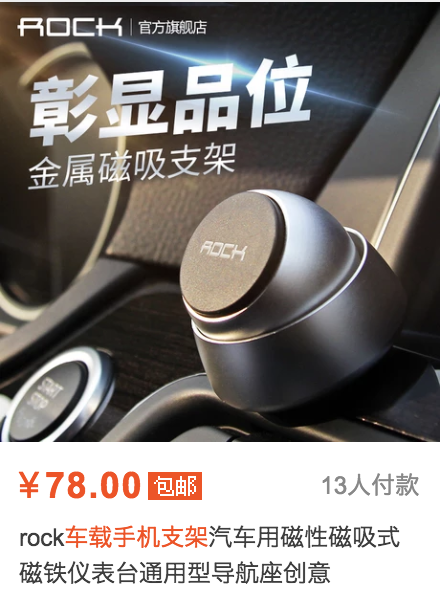
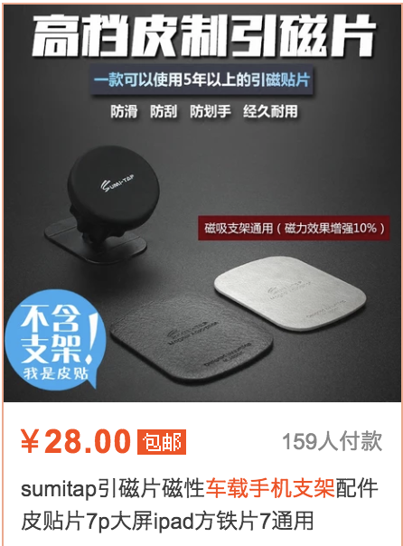
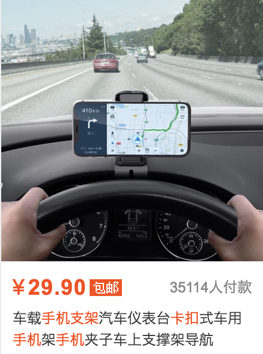
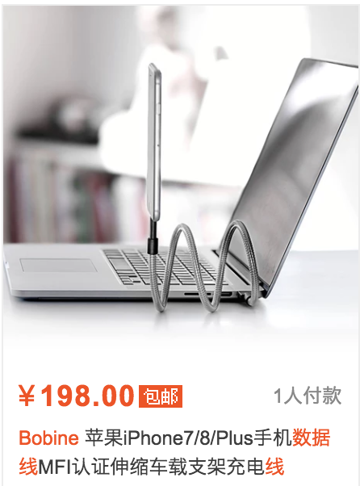
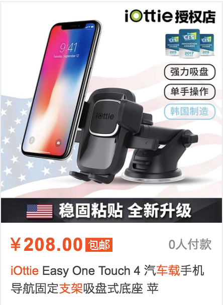

## 前言

市面上车载支架按照安装方式基本分为吸盘，粘贴，通风口，CD 口，我的车是英菲尼迪 Q50L ，空调的出风口是竖排的，因为买过几款手机支架都不是很合适。这里分享一下我的使用体验。

### 磁性吸附

价格适中，质感不错。但手机也要使用贴片，手机增加贴片后不美观，送的贴片廉价感适中。支架需要粘贴，可调节角度范围很小，白天的话，角度太低，会因为阳光反射而看不清手机。稳定度适中，没有出现因为颠簸掉落的情况。

###  卡扣仪表盘

价格便宜，购买后并没有使用，最主要的问题是遮挡视野，为了安全驾驶不建议使用，质感也很廉价。

### 充电线款

使用中无法使用手机壳，如果手机带套，充电插口会松动，所以也没有使用。 如果直接使用稳定度还算可以，应该不会掉落。想固定在车内，还需要辅助贴。

### 吸盘式

目前使用的是这款。价格较贵，但质量很好。稍微会遮挡视野，与粘贴位置有关。可单手拿放，很方便，卡扣很紧，不会因为颠簸造成滑落。可调节范围很广。

** 以上配图都是随便截的，购买记录都删掉了**
