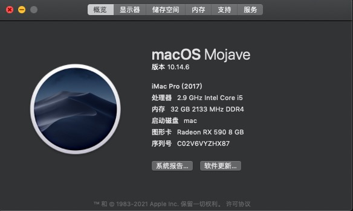
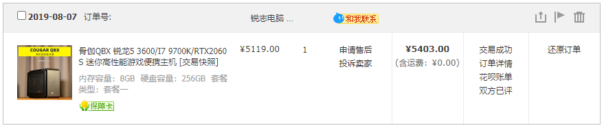
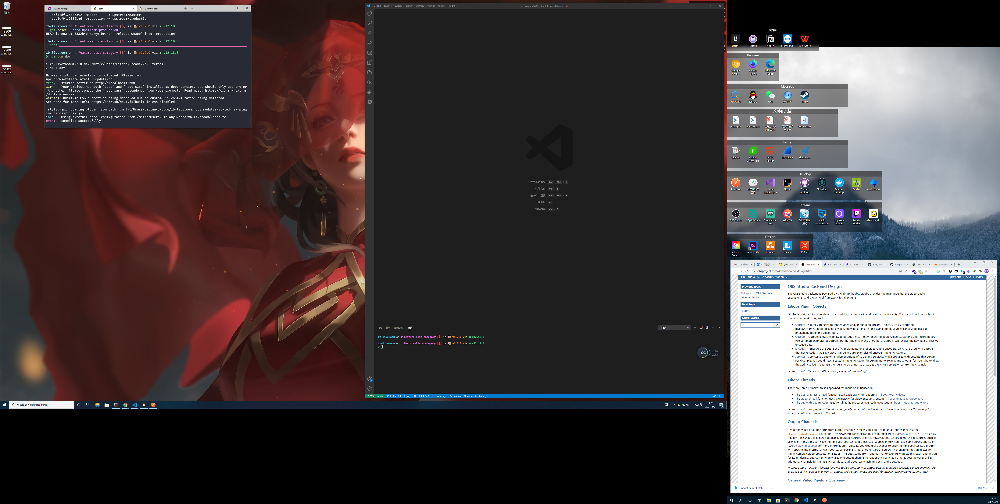
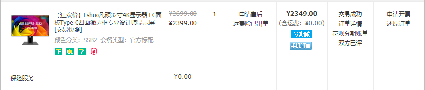
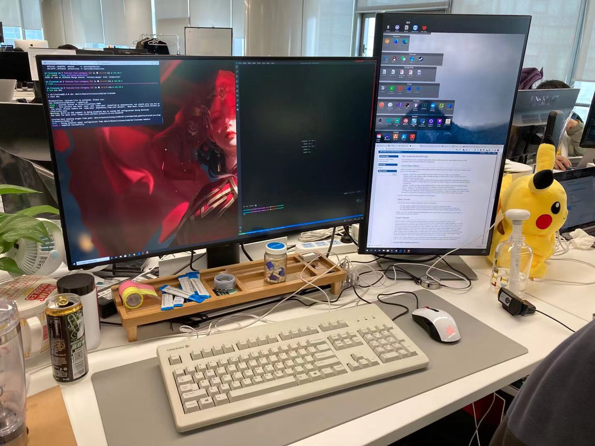
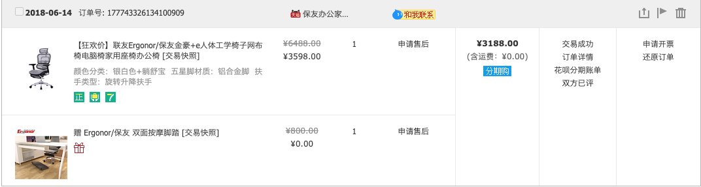

我在公司的开发设备是双系统的黑苹果台式机，macOS 和 Windows10，Windows10 中使用 Ubuntu 的 WSL，几乎开发体验与 Mac 没有区别。

我在家里有一台 Macbook Pro, 作为备用机器。

我的桌面和常用软件

公司外接两台显示器，一台年代已久的 Dell 2715h 和 一台拼装的 32in 4K 显示器。

下面是一张全景：

 我的手机是一台 Google Pixel 3 和 Apple Se 2.

键盘是 Cherry G80，鼠标 赛睿 Rival 106.

椅子是保友金豪 e 系列

