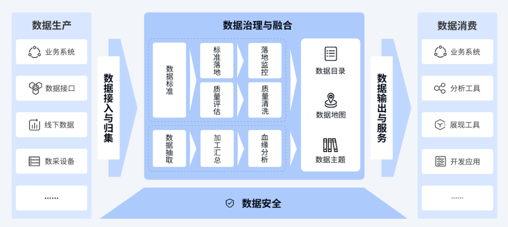

---
title: 玩转数据资产
date: 2019-8-9 11:00
tags: [数据, 元数据]
categories: [数据]
---

# {{$page.title}}

发布时间：**2019-11-13 15:40**

# 数据资产管理平台

玩转数据资产

遵循“微服务、大平台、轻技术、易操作”的设计理念，以大数据处理技术为支撑，
以数据规划与管理咨询方法为指导，以数据聚合、治理、融合、服务为核心，致力于为用户提供有效的数据资产沉淀工具，
服务数据资产管理、数据治理、数据仓库建设、数据中台落地等企业诉求，实现数据驱动业务，支撑数据价值发现。

为了找到适合的数据资产管理产品，首先需要了解公司自身的痛点，再根据痛点在考察各竞品的功能，本文正是基于这样的思路进行分析。

一、痛点及需求

在实际数据管理时，常遇到这样的问题：

- 数据语言不统一：不同业务系统同样指标或字段定义不一致，缺少统一的数据命名规范和标准
- 数据找不到、读不懂：数据多源头，分析师和技术不知道想要的数据在哪、数据加工逻辑等，无法厘清信息资产
- 数据不可信：缺乏数据的质量管控和评估手段，无法保障数据准确性、一致性、有效性等
- 数据不可联：“烟囱式”开发，数据不共享、不流通，无法实现跨领域的数据分析和数据创新

对于上述问题，提炼出以下需求点：

- 数据标准：建立统一的数据规范命名体系，保障数据口径一致
- 元数据：建立数据资产地图，包括元数据管理、血缘及影响分析、资产目录等
- 数据质量：建立数据质量规则和质量监控机制，帮助用户及时发现数据质量问题
- 数据建模：数据建模管理旨在可视化构建数据仓库模型，对模型进行规范约束，并且实现模型的全生命周期管理
- 数据集成开放：将分散的、异构数据源进行抽取、清洗、转换、融合，最后加载到指定数据库

二、产品功能分析

数据资产管理平台需要实现以下功能：

1、数据标准管理

数据治理，标准先行，数据治理标准是大数据标准体系建设中的重要一环，对数据集成和数据资源共享具有重要意义。数据标准建设可以规范系统建设时对业务的统一理解，增强业务部门、技术部门对数据的定义与使用的一致性，减少数据转换，提升数据质量，促进数据的集成和共享。可以防止数据用语的混乱使用，保障数据的正确性和准确性。数据标准管理支持模型标准管理、标准字典管理、标准文档管理等功能。

（1）支持标准字典管理，可对标准字典进行添加、编辑、查询、删除操作；支持标准字典的批量导入操作；支持对标准字典的自动匹配和手动匹配。

（2）支持代码集管理，可对代码集进行添加、编辑、查询、删除操作；支持代码集的批量导入、导出操作。

（3）支持常用词汇管理，可对常用词汇进行添加、编辑、查询、删除操作。

（4）支持数据模型标准的启用、停用，将定义的模型标准引入模型设计过程中，保证模型的合规性和数据中心规范性。

（5）支持上传各种类型的标准文档，从而进行统一的存储和管理。

2、元数据管理

元数据管理是数据资产管理平台的核心组成部分，贯穿于数据资产管理平台的创建、维护管理和使用的各个环节之中，元数据管理帮助数据资产管理平台统一数据口径、分析数据关系、管理模型变更，是数据资产管理平台高效管理的有力保障。同时要以元数据为驱动，构建完整的数据管理和数据服务体系，一方面元数据实现数据生产、服务全链路信息的集中管理和展示，另一方面数据的作业管控、质量管理需要以元数据为标准。元数据管理支持多数据源管理、元模型管理、元数据版本管理、全文检索、血缘关系等功能。

（1）支持整个数据仓库的所有资产的概括，包括表的数量、实体表数据所占空间、表的的稽核分数；支持对整个数据仓库或者某一个一级目录下的资产的评估；支持对整个数据仓库或者某一级目录所涉及到的数据库资源的情况的展示。

（2）元数据采集功能：支持灵活多样的元数据采集适配器及任务配置管理。元数据具备采集多种数据库类型数据的能力，支持主流的数据库包括 Oracle、Vertica、HDFS、HIVE2、CirroData、DAMENG、Netezza、REDIS、Impala、ES、LibrA、DB2、PG(PostgresSQL)、HBase、MySql、GBase 等国内外主流关系型数据库；支持 Hadoop 生态圈；支持 FTP。

（3）支持元数据模型的多版本管理，可查看任意两个版本对比信息，实现清晰的版本回溯；支持元数据模型按编码、名称、类型等条件的查询和统计，类型包括数据库资源、FTP 资源、代理资源、表、视图、函数、存储过程、稽核规则、文档、接口文件、指标和维度等多种元模型，能够支撑数据仓库环境的各类元数据管理模型。支持对元数据的管理，比如元数据的增、删、改、查等。提供对元数据的分级浏览、版本控制等功能。

（4）变更时间轴，提供的元数据变更时间轴功能，针对所有被管理的元数据对象（包括表、映射、工作流等），记录其产生时间，编辑时间、增删内容时间等，并以可视化界面形式展示。

（5）异常观察，监控平台内异常的元数据对象，包括注释不规范和孤立元数据对象，以饼图分类占比和列表明细展示。

（6）元数据采集适配器是一种驱动和解析器，用来接收、解析各种不用类型数据源的数据，将有效的元数据存入模型，并建立关系。包括：库表结构适配器、PowerCenter 适配器、E/R Win 适配器、数据平台血脉分析适配器、指标适配器、代码适配器、表头适配器等。

（7）元数据快速查询能力，通过全文检索快速定位元数据，查阅元数据基本信息、任务信息、稽核信息、数据服务信息。

（8）应具备支撑数据溯源能力，支持数据库对象级、字段级血缘关系溯源，包括血缘分析、影响分析、来源追溯、差异分析等。

（9）与数据质量稽核工具无缝集成，支持数据问题的精准定位与字段级血缘关系解析，可字段级溯源，可溯源血缘关系线的映射规则。

（10）支持元目录管理包括目录的添加、删除、修改等，并支持元数据对所在元目录进行目录定位；支持元数据的获取管理包括自动扫描获取、系统手工录入、批量导入等方式。

（11）元数据支持数据地图展现是以拓扑图的形式对数据系统的各类数据实体、数据处理过程元数据进行分层次的图形化展现，并通过不同层次的图形展现粒度控制，满足开发、运维或者业务上不同应用场景的图形查询和辅助分析需要。

（12）支持元数据码值维护。

3、数据质量管理

数据质量管理面向数据资产管理平台全量数据，通过提供可视化的稽核规则配置、自动化的稽核任务执行、直观的稽核结果分析评估，帮助客户实现数据质量自动检查与监控，在对数据进行全生命周期质量管理的基础上推动数据质量的持续改进，保障数据仓库建设有条不紊的开展。数据质量管理支持规则配置、质量稽核、自定义规则扩展、智能化稽核规则推荐、可视化规则配置页面、稽核规则复用、数据存储分流、质量分析报告、稽核问题处理流程化等功能。

（1）支持内置质量稽核规则，能够进行空值校验、重复校验、格式校验、波动校验、参照校验、值域校验、一致性校验、逻辑校验、关系校验、记录数校验等，支持使用自定义校验；支持 kafka，hdfs 实时稽核。

（2）支持基于元数据对象热度的稽核规则配置。

（3）支持数据质量的规则模板的添加、编辑、引入、删除、查看、草稿箱、规则导出批量导出等基本功能。

（4）支持一个逻辑稽核对象规则可以配置到多个物理稽核对象，无需重复配置，实现稽核规则的复用，大大减少稽核规则配置的工作量。

（5）支持稽核任务的可视化、自动化配置，支持异常工单流程的可视化配置。

（6）支持事件或者时间依赖的自动化稽核任务执行。

（7）稽核任务执行支持库内库外两种执行方式，确保资源合理使用。库外执行采用 Spark 引擎，保障任务最优执行效率。

（8）支持稽核任务监控，对执行完成或正在执行的稽核任务，可以在稽核任务中查询到，根据名称、稽核资源或实体对象查询；支持稽核任务查看、启动运行实例、删除和历史版本的操作。

（9）支持表级和平台级质量稽核报告定时生成，支持稽核规则的查询与统计，可依据不同数据域查阅规则的变化趋势、规则总数、规则覆盖率等。

（10）支持稽核结果状态查看包括对象名称、对象类型、正常|告警|类型、执行状态，稽核结果，是否可用、开始时间、结束时间、执行时间等。

（11）支持稽核结果明细查看，包括稽核对象、稽核规则、限定条件、规则参数、任务状态、稽核结果及结果集、异常样例数据、异常数据导出等内容。

（12）支持基于字段级血缘关系的数据质量追踪，可以在血缘关系上对错误数据进行精准定位、对数据处理过程精准追溯，查看错误的样例数据，快速定位问题来源；并且配置稽核规则的字段后有不同颜色标志，以判断该字段稽核结果优劣。

（13）支持稽核规则配置和稽核结果提取错误数据时进行脚本预览。

（14）支持多种内置及自定义算法对接入数据进行剖析探查，直观展现数据情况，辅助用户快速了解掌握数据，为规则配置提供推荐。

（15）实现在稽核过程中将错误数据和正确数据分开存储。

4、数据建模管理

数据模型直接反映出业务部门的需求，它的作用在于可以通过实体和关系勾勒出平台数据蓝图。因此，数据模型对于数据仓库的建设有着重要意义。数据建模管理旨在可视化构建数据仓库模型，对模型进行规范约束，并且实现模型的全生命周期管理，助力企业进行全方位的业务梳理，建立全方位的整体数据视角，为整个数据平台提供一致的基础逻辑，降低数据模型应用中的重复开发成本，加快数据仓库建设的速度。数据建模管理支持可视化数据建模操作、模型全生命周期管理、模型质量检测等功能。

（1）系统支持可视化、图形化、拖拉拽式数据建模方式，可视化进行逻辑模型编辑与关系创建。

（2）系统支持模型结构的导入、添加。

（3）系统支持根据逻辑和物理字段类型映射关系，模型直接物化落地。

（4）系统对已落地模型提供统一数据库访问工具，无需创建多个客户端就可对数据存储体进行访问。

（5）系统支持模型落地检测，对比物理落地模型与仓库模型的差异，监控模型部署质量。

（6）系统支持的数据库资源包括 ORACLE 、HIVE、CirroData(Xcloud)、DAMENG(达梦)、GP、LibrA、PG、MySql、GBase 等。

5、数据集成开放

数据集成开发面向数据仓库建设，提供无需编码的全图形化数据开发环境，完成数据中心 ETL 过程设计、维护、运行、监控，将分散的、异构数据源进行抽取、清洗、转换、融合，最后加载到指定数据库。通过分布式数据处理和任务调度，高效的完成数据集成，提高数据处理效率、规范开发流程，从而显著降低数据集成的成本。数据集成开发支持多源异构数据适配、全图形数据开发、实时数据处理能力、脚本解析映射、自动生成血缘关系等功能。

（1）支持数据处理过程中的样本测试功能，方便对设计好的数据处理流程进行调试和预览。基于测试结果查看脚本或者定义及时发现潜在问题，有效提升数据集成质量 。

（2）支持元数据管理功能，基于 web 方式管理数据源，web 方式抽取和管理元数据。

（3）支持全图形化数据流、工作流、任务流的可视化配置。

（4）支持计划调度，事件触发，手动执行等方式控制流程的启动。

（5）面向不同应用，做相应的数据汇聚处理。提供可插拔的智能计算引擎适配器（spark、oracle、hive 等）保障数据处理的最优执行效率，支持对任务流程设置占用计算资源参数，实现资源的合理分配和最优利用。

（6）提供丰富的数据处理内置组件，如包括数据筛选、数据合并、数据排序、数据汇总、数据分组、以及上百种函数的表达式转换等复杂处理组件，任务组件包括条件判断、java、shell、sql、存储过程、数据流等任务编排调度组件；支持自定义插件扩展。

（7）提供全图形化的数据处理开发环境，可以拖拽式完成复杂的数据处理流程设计，解放手工编码，简化了数据开发难度，全面提升数据开发效率，方便后期数据处理流程的维护。

（8）支持 kafka 以及 HDFS 数据源实时加工以及 HDFS 数据源准实时数据加工，并支持加工过程中抽取外部数据源数据以及分发数据。

（9）支持相同结构的元数据对象，通过修改流程中元数据对象所属资源，实现新的数据处理，不需要重新设计数据流，节省数据开发时间。

（10）支持对单个或多个流程进行错误节点的恢复。异常恢复保证恢复的流程从异常点开始重新启动，保障数据的最终完整性和一致性。

（11）支持任务实例执行过程可视化监控，包括任务的执行状态、依赖关系、运行日志，支持对流程实例进行暂停、终止、恢复等功能，提供对并发任务的监控以及优先级调整，提供对异常任务的监控和判断。

（12）支持已有的 SQL 脚本编写的业务流程一键转化成数据处理的可视化映射。

（13）支持数据处理调度一体化。可视化页面配置好规则后，直接配置执行引擎以及计划调度。

（14）支持云化服务及分布式部署、支持集群部署以及平滑升级。

（15）支持集群部署。支持单表并行抽取与加载。支持在流程编辑视图中支持任务节点编排的变量自定义设置。

（16）支持在数据加工过程中，以虚拟节点构建可生产落地的数据模型，直接配置启动执行计划，实现数据加工、建模流程化操作。

三、总结

最后，我们来总结一下数据资产管理，它提供了以下业务价值：

1、建设数据资产管理能力体系；

2、多环境一体化的数据对象管理（注册、审计、统计、影响分析等）；

3、从全局角度初步提升各环境的数据质量；

4、为基于大数据的应用创新提供基础，可输出各类标签库；

同时，通过数据资产管理平台的数据积累，通信行业可以得出如下标签：

1、客户标签类（客户自然属性、客户偏好信息、客户群信息）；

2、终端信息类（某一终端品牌在特定时间区间下的用户群分布、地域分布、型号分布、市场占比情况等信息的查询服务）；

3、位置信息类（某具体位置在特定时间点或区间下的客流量、客户群分布等信息查询服务）等；

在组织及制度流程的保障下，通过第三方中立平台进行大数据资产的管理是一个可行且必由之路！
