---
title: 元数据管理流程及技术方案分享
date: 2019-11-13 15:40
tags: [数据, 技术方案]
categories: [数据]
---

# {{$page.title}}

发布时间：**2019-11-13 15:40**

**元数据管理流程及技术方案**

元数据管理是数据资产管理平台的核心组成部分，贯穿于数据中台的创建、维护管理和使用的各个环节之中，元数据管理帮助数据中台统一数据口径、分析数据关系、管理模型变更，是数据中台数据建设和数据资产高效管理的有力保障。同时要以元数据为驱动，构建完整的数据管理和数据服务体系，一方面元数据实现数据生产、服务全链路信息的集中管理和展示，另一方面数据的作业管控、质量管理需要以元数据为标准。元数据管理支持多数据源管理、元模型管理、元数据版本管理、全文检索、血缘关系等功能。

元数据应贯穿数据采集、加工、稽核、服务全过程，实现数据全生命周期的描述；支持技术元数据、业务元数据、管理元数据的统一管理；元数据具备采集多种数据库类型数据的能力，支持主流的数据库包括 Oracle、Vertica、HDFS、HIVE、DAMENG、REDIS、Impala、GP(Greenplum)、Aliyun（odps）、ES、SQLSERVER、DB2、PG(PostgresSQL)、HBase、Teradata、MySql、GBase 等国内外主流关系型数据库，支持 Hadoop 生态圈，支持 FTP；支持元数据版本管理，可查看任意两个版本对比信息；支持元数据模型按编码、名称、类型、是否有效等条件的查询，类型包括数据库资源、FTP 资源、代理资源、表、视图、函数、存储过程、稽核规则、文档、接口文件、指标和维度等多种元模型，能够支撑数据仓库环境的各类元数据管理模型；提供的元数据变更时间轴功能，针对所有被管理的元数据对象（包括表、映射、工作流等），记录其产生时间，编辑时间、增删内容时间等，并以可视化界面形式展示；通过全文检索快速定位元数据，查阅元数据相关信息，实现元数据的快速查询；与数据质量稽核工具无缝集成，支持数据问题的精准定位与字段级血缘关系解析，可字段级溯源，可溯源血缘关系线的映射规则。支持元目录管理包括目录的添加、删除、修改等，并支持元数据对所在元目录进行目录定位；支持元数据的获取管理包括自动扫描获取、系统手工录入、批量导入等方式。

**1、元数据采集功能**

平台元数据管理的元模型符合 CWM 规范，支撑多种元模型，包括有数据库资源、FTP 资源、代理资源、文件资源、表、视图、函数、存储过程、程序、文档、接口文件、指标和维度等多种元模型，能够支撑数据仓库环境的各类元数据管理模型，实现灵活多样的数据采集和任务配置管理。

**1.1 多数据库类型识别**

数据库资源支持：Oracle、Vertica、HDFS、HIVE、CirroData、达梦（DAMENG）、EDIS、Impala、GP(Greenplum)、Aliyun（odps）、ES、SQLSERVER、LibrA、DB2、PG(PostgresSQL)、HBase、Teradata、MySql、GBase 等国内外主流数据库。

平台元数据支持的数据库类型如下图所示。

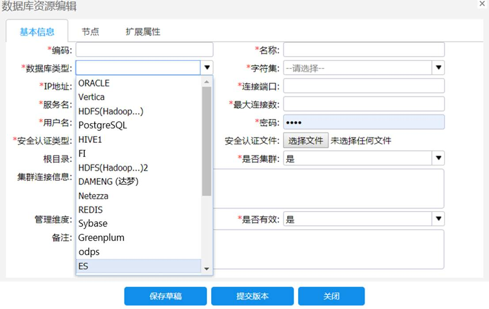

图 2 支持的数据库类型 1

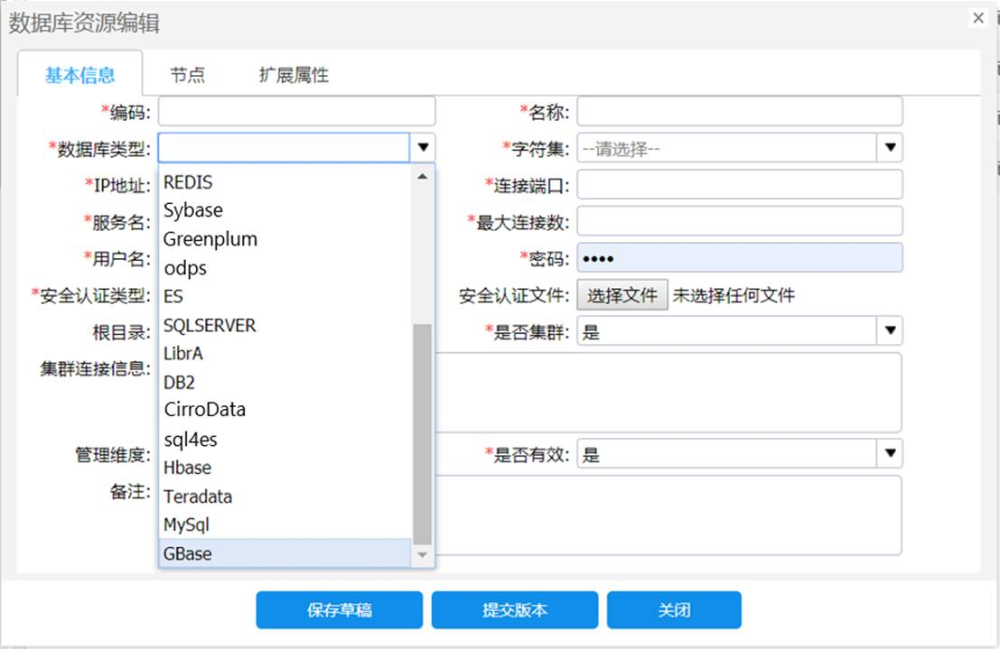

图 3 支持的数据库类型 2

**1.2     Hadoop 生态圈采集**

[Hadoop](http://baike.baidu.com/view/908354.htm)是一个由 Apache 基金会所开发的[分布式系统](http://baike.baidu.com/view/991489.htm)基础架构，Hadoop 的核心是 YARN,HDFS 和 Mapreduce。平台支持 hadoop 生态圈，支持 HDFS、Hive、Hbase 等类型。

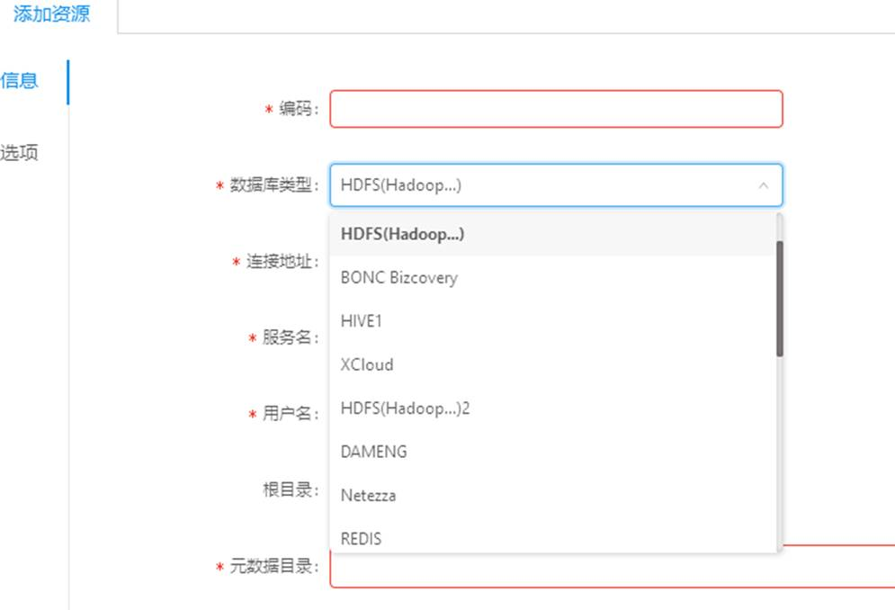

图 4 支持 Hadoop 生态圈

**1.3     FTP 资源采集**

FTP 是 FTP 服务器管理，在元数据平台上主要用于文件所属 FTP 或流程调度。

1）1、在“资源”目录上可添加 “FTP 资源”，编辑 FTP 资源信息。

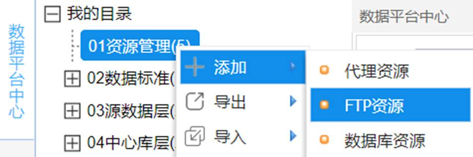

图 5 添加 FTP 资源菜单

2）2、FTP 资源属性内容，以下是必输项：

（1）编码：FTP 资源对象的唯一符，一般有字母、数字和常用符号组成

（2）名称：FTP 资源名称

（3）模式：FTP 的主动和被动模式

（4）FTP 归属：FTP 归属的组织机构

（5）连接地址：FTP 所属服务器 IP

（6）连接端口：FTP 端口

（7）用户名：连接用户名

（8）密码：连接用户名的密码

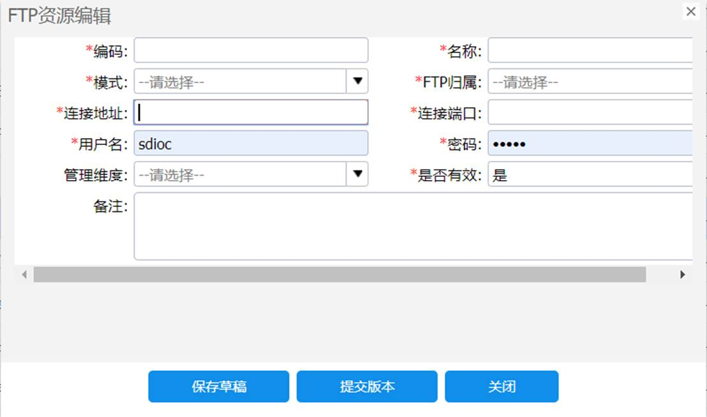

图 6 添加 FTP 资源

**1.4     数据源扩展**

支持用户自定义扩展元模型，满足客户个性化的元数据管理需求，具备元模型查询、增加、修改、删除以及元模型属性的查询、增加、修改、删除的功能。用户可以根据需要建设自定义类型的元模型。

元模型管理页面，点击“添加”，新增一个元模型，对元模型的名称、编码、包名、模型类型进行编辑。

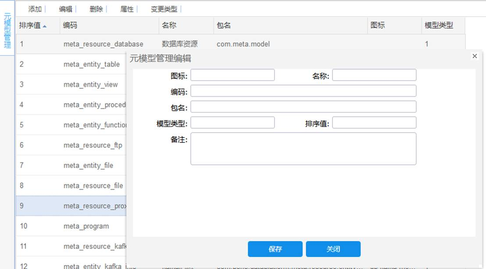

图 7 自定义元模型

① 元数据模型定义

平台支持元数据模型按编码、名称、类型、是否有效等条件等方式的查询和统计，包括数据库资源、FTP 资源、代理资源、表、视图、函数、存储过程、稽核规则、文档、接口文件、指标和维度等多种元模型，能够支撑数据仓库环境的各类元数据管理模型，对指标类数据，支持指标树功能。

1）平台支持元数据模型按编码、名称、类型、是否有效等条件等方式的查询和统计，查询结果列表信息包括编码、名称、类型、归属管理、创建时间、修改时间、备注信息、是否有效等内容。

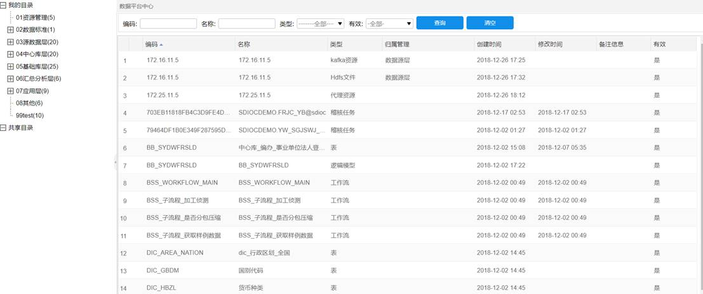

图 8 元数据模型查询

2）元模型类型包括数据库资源、FTP 资源、代理资源、表、视图、函数、存储过程、稽核规则、文档、接口文件、指标和维度等多种元模型。具体如下图所示。

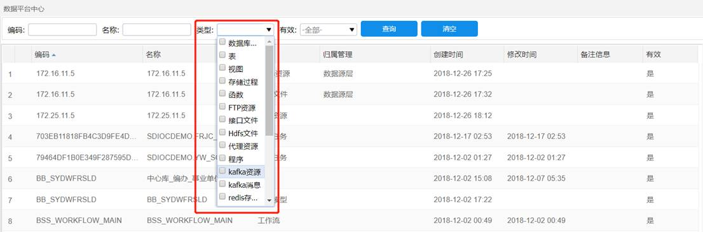
元模型查询类型 1

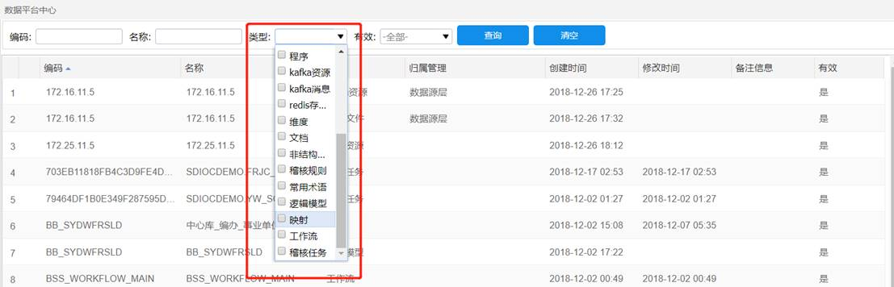

图 9 元模型查询类型 2

**2  元数据统一管理**

**2.1 元数据获取管理**

基于元模型类型在目录上添加相应的元数据对象，元数据的获取管理包括自动扫描获取、系统手工录入、批量导入三种方式。

**2.1.1 自动扫描获取**

1）手动扫描

（1）扫描某一个用户下所有对象

扫描用户：填写扫描的用户名称。

目录：扫描成功后，元数据对象所在的目录。

图 10 手动扫描配置

（2）扫描一个或多个用户某些对象

实体类型：选择需扫描实体对应类型，如表。

扫描用户：扫描对象所属的用户名称。

关键字：实体名。

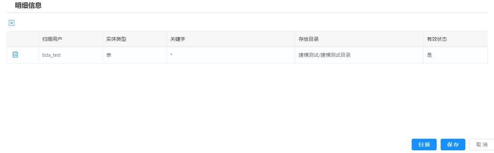

图 11 扫描明细

2）定时扫描

按照上面其一设置好扫描内容后，如扫描数据库全部对象。

启动时间：选择启动的时间点。

扫描周期：定时启动扫描的周期，分为单位。

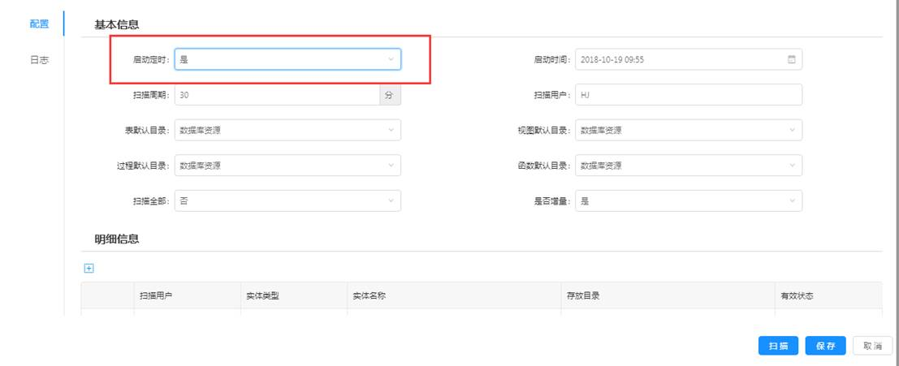

图 12 定时扫描配置

**2.1.2 系统手工录入**

对于无法通过获取接口或者编译技术进行自动获取的元数据，需要通过手工整理的方式进行处理。系统支持通过手工录入的方式对元数据进行录入，录入信息包括元数据的基本属性信息及元数据结构信息。

1）在数据平台中心选择一个目录，在其上右击，点击“添加”，继续点击“数据库资源”。

2）添加数据库资源

数据库资源包括基本信息、节点、扩展属性等内容。

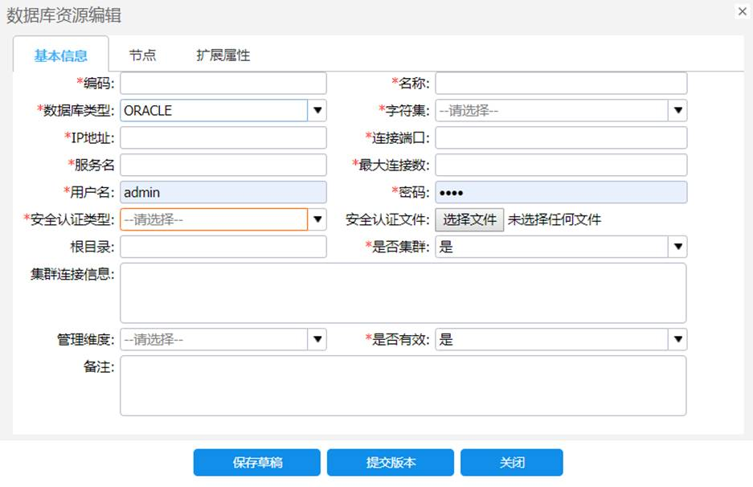

图 13 手工录入数据库

3）添加表

表的内容包括基本信息、参数、扩展属性。

（1）基本信息

基本信息包括编码、名称、所属资源、所属用户、脚本编写人、脚本维护人、脚本编写时间、是否有效、输入参数、输出参数、管理维度、状态、过程 Sql、备注信息等内容。

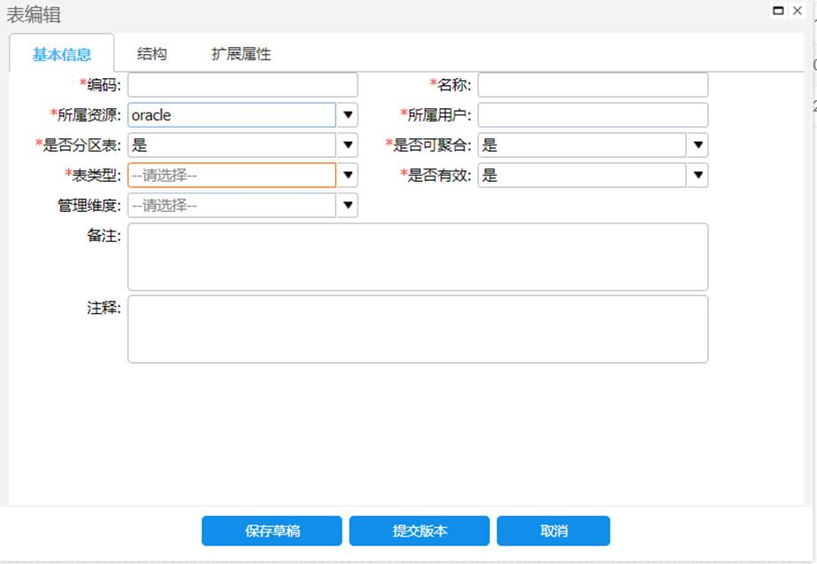

图 14 手工录入表

（2）结构

录入的表结构内容包括序号、字段、名称、类型、数据物理类型、是否主键、是否可空、长度、精度等内容。

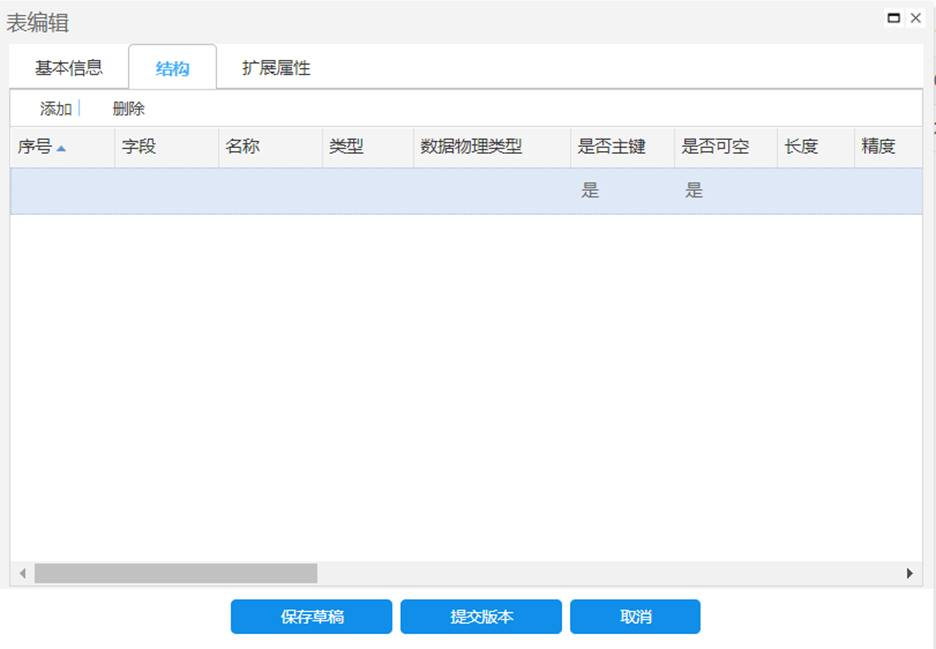

图 15 添加数据库表结构

（3）扩展属性

扩展属性包括来源类型、数据周期、主题域、是否 BI 表、是否对外发布、仓库分层、分区类型、数据条数、业务类型、使用状态。

**2.1.3 批量导入**

系统支持通过使用标准模板编制的元数据信息文件在系统中的批量导入，为元数据的获取提供了便捷途径。

1）在数据平台中心选择一个目录，在其上右击，点击“导入”，继续点击“表”。

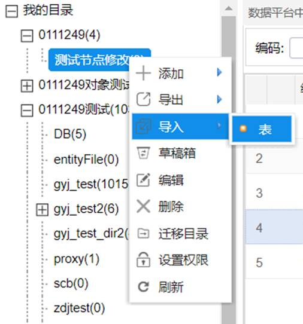

图 16 导入实体表菜单

2）选择要导入的实体表数据文件，填写备注信息，然后点击“导入”按钮，即可批量导入元数据。

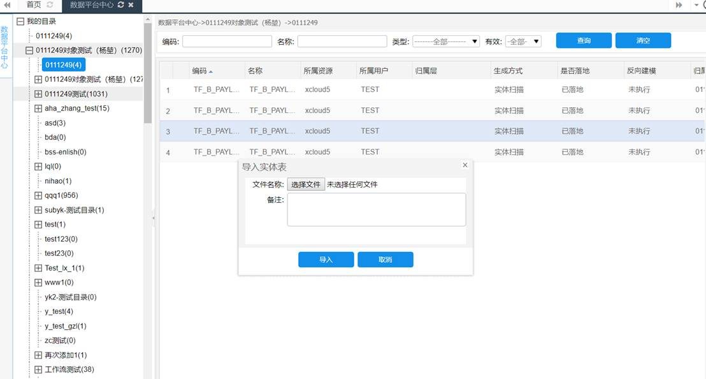

图 17 批量导入

**2.2 元数据导入导出管理**

系统支持通过使用数据中心编制的元数据信息文件在系统中的导入导出功能，为元数据的获取提供了便捷途径。

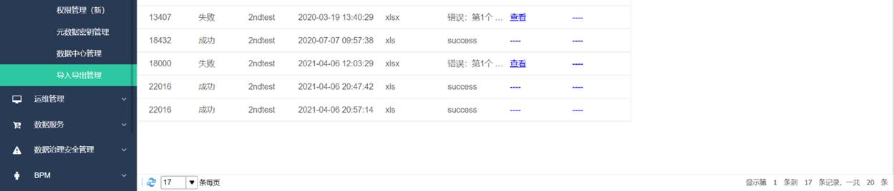

图 18 元数据导入导出

**2.3 元数据界面浏览**

元数据管理系统界面有菜单栏，展示区，登入用户信息，系统退出。菜单栏下有子菜单，每个菜单对应一个功能。

**2.4 元数据查询管理**

**2.4.1 全文检索**

全文检索是在数据平台中心快速查询元数据对象，查看元数据对象信息。

平台提供基于目录和关键字的元数据对象全文检索功能。目录包括数据库资源、表、视图、存储过程、函数、FTP 资源、接口文件、Hdfs 文件、代理资源、程序、维度、文档、逻辑模型、工作流。

搜索框输入关键词“\*”表示查询全部，输入多词用“，”隔开，支持多词精确匹配。

**2.4.2 检索结果**

在检索界面上选择目录或者输入要检索的关键字，检索之后，以元模型分类显示，并统计出每个模型含有关键字的对象个数，界面中分两部分展示检索结果，左侧列出对应模型下含关键字的对象列表，右侧展示列表对象的基本信息。

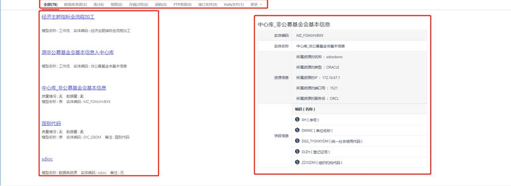

图 19 检索结果

在检索结果界面，可选择具体元数据类型进行垂直检索，点击“表”，则检索出所有属于表的元数据对象。

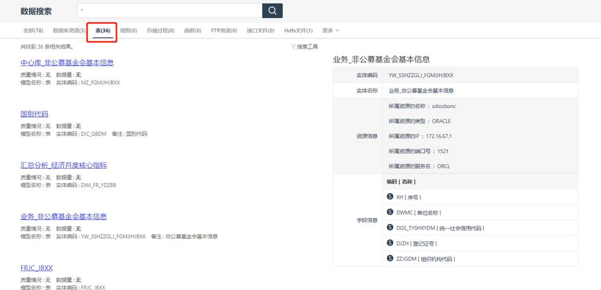

图 20 根据元数据分类检索

在检索结果页面，鼠标点击检索出的元数据对象名称，可查阅元数据对象的基本信息、任务处理信息、稽核信息、数据服务发布信息。

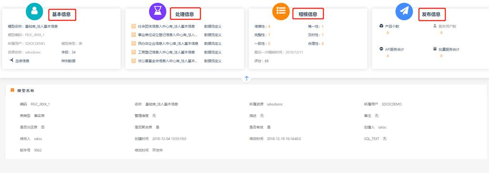

图 21 检索出的元数据信息

**2.5 元数据版本控制管理**

平台记录元数据的每次变更信息，提供版本变更历史查询，可查看任意两个版本对比信息，实现清晰的版本回溯。

元数据历史版本以列表形式展示每一个版本的信息，并且能够查看每个版本的元数据对象信息。可查看的信息属性，参考元模型属性定义规范。

版本比较可以对任意两个版本进行比较，并且两个版本不同的信息将用颜色进行显著标明。

1）在元数据列表中选中一行元数据右击，鼠标移动到“历史版本”，点击
“历史版本”进入历史版本界面。

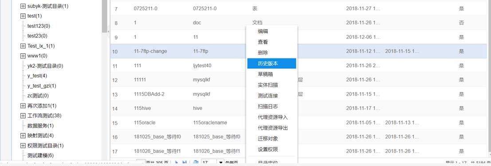

图 22 历史版本菜单

2）历史版本列表界面可查看版本号、编码、名称、字符集、数据库类型、IP 地址、连接端口、服务名、最大连接数、主对象表、用户名、备注等信息，在此页面可进行版本比较和版本的查看。

3）在历史版本列表页面任选两个版本后右击，弹出版本比较和查看菜单，点击“版本比较”菜单进入版本比较结果页面。

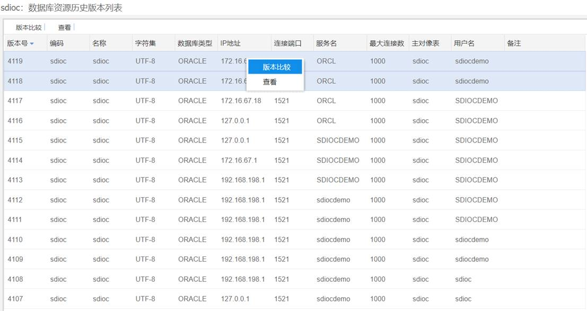

图 23 版本比较菜单

4）在版本比较结果页面会将两个版本不同的信息用颜色进行显著标明。另外，版本比较可以对任意两个版本进行比较。

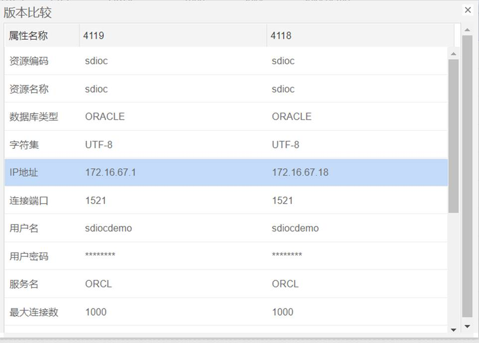

图 24 任意两个版本比较

5）在版本列表页面，选中任一版本可查看历史版本的详细信息。

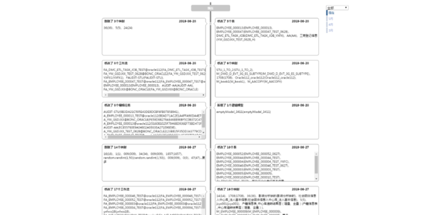

图 25 历史版本详细信息

**2.6 元数据分析管理**

**2.6.1 数据地图分析**

数据地图分析是以拓扑图的形式对经营分析系统的各类数据实体、数据处理过程元数据进行分层次的图形化展现，并通过不同层次的图形展现粒度控制，满足开发、运维或者业务上不同应用场景的图形查询和辅助分析需要。

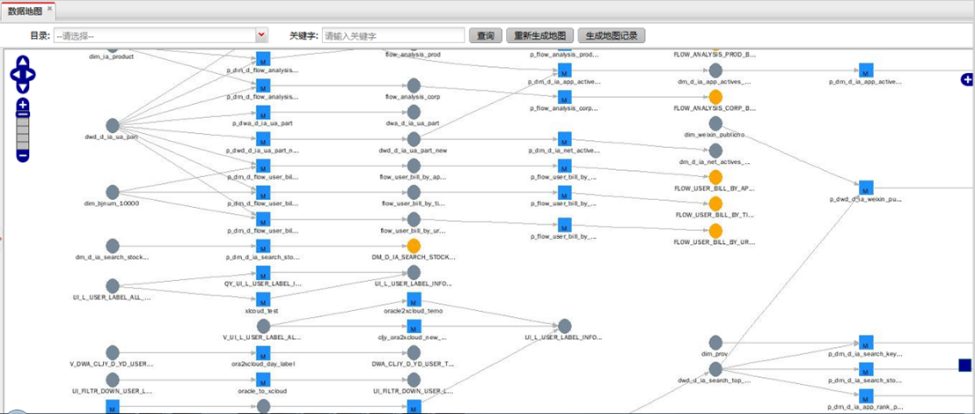

图 26 数据地图分析

**2.6.2 差异分析**

元数据管理模块应具备对元数据本身质量进行检查的功能，保证元数据自身的数据质量。元数据异常观察分析包含但不限于以下内容：元数据一致性、元数据关系的健全性、元数据属性的填充率、元数据名称重复性、元数据关键属性的填充率和元数据关键属性值的唯一性。

**2.6.3 血缘关系分析**

支持数据问题的精准定位与字段级血缘关系解析，可字段级溯源，可溯源血缘关系线的映射规则。

字段级血缘关系查看界面如下图所示，配置稽核规则的字段后有不同颜色标志，支持数据问题的精准定位，以判断该字段稽核结果优劣。
具体如下图所示，箭头处的红色标识符说明该字段是稽核结果问题字段。

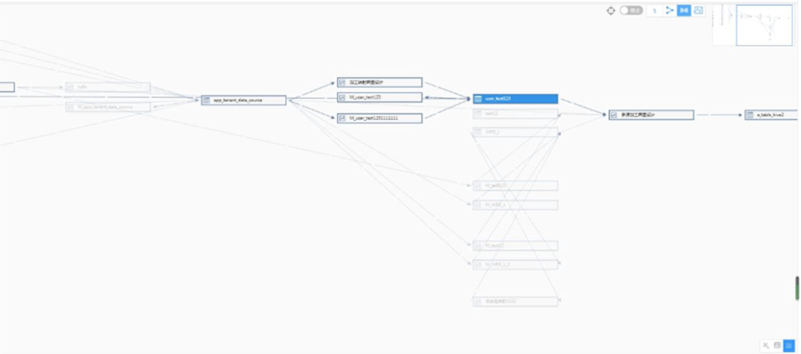

图 27 字段级血缘关系

点击字段间的血缘关系线，系统跳转至计算规则界面，该界面显示元数据字段级血缘关系线的映射规则。
