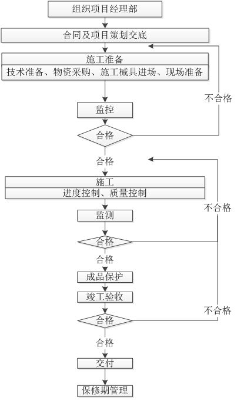

---
title: 项目实施及质量保障措施方案模板
date: 2020-3-19 21:35
tags: [项目实施, 模板]
categories: [数据]
---

# {{$page.title}}

**2020-3-19 21:35**

1. # 项目实施方案
   1. ## 系统集成方案
      本公司凭借在系统集成领域多年的从业经验，向客户提供完整的系统建设方案。采用领先的产品设备，并秉承“简单、可靠、创新”的宗旨，为用户提供最好的系统集成服务。

本公司将向客户提供各种智能的、高性能的、经济高效和容易使用的系统集成方案，与客户紧密沟通，与合作伙伴建立高效的商务合作关系和供应链关系，是公司竞争的法宝。公司既要为用户建设优质的系统集成工程，同时一定要为用户培养一支过硬的技术队伍。

采用信息化技术作为主要管理手段，建立信息化的管理平台，在施工过程对整个工程的工期、质量、成本进行有效的控制。编制详细而周密的施工整体控制计划，明确各专业进场和配合及交出时间，以保证整体计划的按期实现。加强工程管理，搞好各工种各专业的配合协调，加强对各专业部分的质量控制，通过严密完善的公司质量管理体系，确保“优良工程”的实现。

我公司在每一次施工前都做好了充分的准备，为每一个项目的顺利实施做好详细的准备计划，为保障工程的实施做好铺垫。

1. ### 施工前准备工作
   1. #### 设备进场的准备
      我公司在每次设备进场前做好了相关的准备。在每一批次的发货数量，每一天的运输数量，在库房中应准备的货物数量，公司都进行仔细的计算，同时也按一定的标准做好物资准备。这样保证了设备物资的供应及时，物流顺畅。
1. #### 客户的沟通联系及准备
   公司积极与客户建立广泛深厚的基础，在每一次安装前都对客户的准备情况做了详细的了解，与客户一同将安装前应做好的准备工作一一落实到位。重点落实项目场地准备情况、强电到位情况。

我公司同时通过自身完善的服务系统，与客户建立了良好的沟通渠道，在每一项工程的施工前都与客户以及当地的主管单位做了认真的了解和调查，及时地将客户和当地主管单位的情况反馈回公司。为项目实施做好了充分的准备。

1. #### 施工组织和管理准备
   1. ##### **施工组织准备**
      公司从项目管理上非常重视施工组织的准备工作，在每一次实施前都进行了施工的组织准备，从项目经理到每一位施工人员都进行了落实，并进行了技术、质量、安全等方面的施工前培训。确立了以项目经理为首的项目小组，这使得每项工程在实施中从组织管理上得到了保障。
1. ##### **施工的管理制度准备**
   我公司已有多年的系统施工经验，并在工程中总结出一套适合系统施工的管理制度，这些管理制度在许多工程中发挥了巨大的作用，为项目的成功实施在制度上做好准备。

本公司的项目管理从质量管理、技术管理、物流管理、物料管理、监督管理、安防管理、文档管理等方面都建立合理、切实可行的制度，在工程中为客户做好的可靠的准备。

1. ### 系统集成项目管理的项目经理负责制及施工的分工和合作
   1. #### 项目经理负责制
      本项目我公司将建立专门的项目小组，实行项目经理负责制。我们有一支素质良好的项目管理人员队伍。针对此次项目，我们将继续发扬项目管理的优势，为整个项目的启动、计划、实施、收尾做好管理控制工作为客户建设优质的网络系统。
1. #### 施工分工
   1. ##### **施工组织分工**
      我公司在工程中不仅进行了组织机构的确立，而且根据各个工程的特点进行组织分工。针对此次项目的工程也采取了组织分工，在组织中一部分进行物流管理，一部分进行技术管理，一部分员工进行质量监督管理，项目经理则进行全面的控制管理。

施工工作分工

在具体的施工中，对每一个施工步骤都进行了分工，每一步与下一步都是紧密衔接的。

1. ##### 施工中的合作
   我公司在施工中与供应商、代理商的合作，曾经成功有力地推动了许多行业客户的工程顺利完工。我公司与供货商、代理商在售前、售中、售后一同对客户负责，共同承担责任。
1. ### 系统集成施工
   1. #### 施工人员进场施工
      项目施工过程中，我公司将严格按照公司、项目施工规范和客户有关要求进行工程施工，客户负责质量监督和验收。
1. #### 系统集成中的施工关键点
   （1）施工技术人员要理解标书中软硬件设备技术要求，完成各系统的全部功能；

（2）各种软件的安装和备份要保持一致，以保证客户在后期的使用和维护上的方便；

（3）硬件设备及工程辅料选用质量好的国内知名品牌产品，以保证工程质量。

1. #### 系统调试
   在软件开发完成及设备安装完毕后，我公司向客户提交一份详细的调试方案及各控制设定点，得到客户的同意后，进行系统调试。

整个系统通电调试，全部通讯无误；软硬件各子系统的配合无误；与其它系统的接口信号传输无误；整个系统的工作稳定正常。

此外，整个系统调试验收阶段将产生如下文档：

系统配置手册；

测试报告书；

系统还将产生其他文档；

进度报告书；

会议纪要；

问答表等。

1. ### 系统集成施工规范性管理
   施工规范是工程质量管理的重要一环，在整个项目实施中更是一个重要内 容。我公司根据已有的经验，总结以往施工中的优点，通过不断改进创新，针对本次施工规范进行了充分准备。
1. #### 施工质量方针、目标的制定
   我公司为本次项目制订了施工质量方针和目标：规范施工、达标上档、用户满意、工程优良。
1. #### 人员管理规范
   我公司为本项目设立了专门的人力资源管理小组，总结并吸取了以往许多. 工作中的人员管理经验，特别是针对项目中人员要求量大，人员种类多，人员分布广的特殊情况，我公司建立了良好的人员管理制度和人力资源管理制度，做到人员分配合理，人力资源配备充分。

人员实行项目负责制管理，对每一位施工人员建立施工档案，配有上岗证(施工证)，统一服装，统一施工用语。要求每一位施工人员每天填写《施工日志》。建立了有效的信息处理制度，让信息快速、有效地传达到每一个需要的岗位。

1. #### 财务和设备管理规范
   在施工中财物和设备是最重要的物资，为保证将每一件设备完好及时地交付到客户手中，我公司在本项目还建立了财物、设备管理规范。

从每一件设备由公司出发，到最终运送到客户手中，我公司都安排有专门的库管人员，有专人进行物资的调配、分发。对每一件物资来去都有明确登记，可追溯查找到每一件设备的来源和去向。

进行物资分发时，我公司同样派出我方有经验的库管员、调度员，一同做好物资的分发，让设备分发有序，配套齐全地送到客户手中。在交到客户手中的设备前，我公司将设置专门设备存放地，并安排专人管理。在分发中有出库记录，有交接手续。

同时还注重在施工中的材料设备、施工机具的规范管理，因为这些物资是我方施工人员在施工时用到的，材料是否合理，工具是否齐全，同时影响到施工的质量。我们每一个项目小组的负责人，在施工中专门负责对材料和工具的管理，让工程布局合理，工作效率不断提高。

1. #### 制度规范、流程、记录和文档管理规范
   我公司为本次项目制订建立了一套项目管理制度，从人员管理到物资管理，从流程管理到进度控制，我公司都将一整套合理、适用的记录和文档。

在每一施工环节中，我公司先根据国际和国家标准制订了一个有效的执行流程，对流程中的每一步骤都做了测试和分析，让在执行中每一步都有据可依，有规可循。

对每一个流程和步骤，项目相关人员都会做相应的工作记录，强制工作人员在施工中按要求施工，并能书面记录上体现出来。

我公司在多年的系统集成施工中，总结出一套行之有效的方法，形成了一套积极有效技术文档，这些技术文档响应了本次标书中关于项目实施与售后服务要求。

对每一项记录和文档都有做好了文档管理，建立了专门的项目文档资料管理库，有专人进行文档管理。

1. #### 建立健全项目组织机构
   健全有效的组织机构是贯彻项目意图和顺利进行项目实施的重要条件和保证。在项目实施中，由于分工责任不明确造成项目管理混乱，将严重影响项目质量的好坏。为确保项目实施的规范化，在项目启动阶段，首要工作就是提出并组建适于特定项目实施和管理的全套组织和领导机构，采用项目总监领导下的项目经理负责制，明确各组人员的职责及各组之间的协调关系，做到分工到人、责任落实。
1. #### 制订切实可行的项目实施方案
   本项目集成内容较多，必须合理安排其有效的先后顺序进行集成才能保证在规定时间之内完成所有建设集成调试工作。因此，一方面是要做好项目的工作任务分解，分析好前后置实施内容；另一方面就是提前准备详细可行的项目实施方案，并通过相关组织及专家顾问的评审，作为项目实施阶段的项目实施指南。
1. #### 制订项目实施计划
   根据实际安装条件、设备到货周期、各种资源状况、传输系统状况和其他现实因素，要求项目经理必须要全面规划出一个符合实际的整个项目进度计划，其中包括项目实施进度计划表和实施人员安排表；各阶段的具体工作内容、工作周期，项目里程碑的定义。
1. #### 严格的项目进度管理
   项目经理作为项目的总接口人及项目总负责人，负责项目实施的全面工作，包括收集有关产品到货、运输、开箱、现场准备、安装进展、用户技术人员反应等有关项目信息。在项目实施过程中，将严格按照项目实施计划，全权负责项目进度的管理与监督。定时向用户项目实施负责人汇报项目进度，在处理突发事件和项目变更时，要及时调整人员和计划以保证项目正常进行；在项目进度受阻时，要及时申请增加人员和技术力量，确保项目进度；在遇到导致项目进展的因素发生时，项目经理将负责采取必要的措施。此外，项目经理要审查技术实施后的项目质量，以确保整个项目顺利、高质量的完成。
1. #### 必要的项目协调会
   由于项目工期时间紧、技术复杂，确保项目顺利实施的一个重要因素协调、调动项目各方面的积极性与创造性，项目各参与方的密切合作和理解是项目实施成功的一个重要基石。

建立标准化的项目技术文档体系是项目管理规范化、程序化的重要手段。通过项目文档体系可以实现对整个项目的计划与预算、定期报告、特别报告、对问题状况的分析、测评和响应这一完整过程，而正确地管理、使用各类文档则使项目管理工作变得有据可依、井井有条。

1. ### 施工实施规范及评审考核规范
   1. #### 项目职责管理
      我公司已建立和实行项目管理有多年，在项目管理有着丰富的经验和知 识，公司也培训了一大批项目实施和管理经验丰富的项目经理，他们在施工中积累了大量的工作经验，特别是在以往的项目施工中，他们不仅充分发挥了项目管理的知识和本领，而且在工程中学习到了更多的知识，为本次项目做好的充分准备。

本公司的项目管理在传统的管理技术上，针对此次项目管理，还建立了一 套项目跟踪分析系统，通过项目的全程跟踪分析，了解到在项目每一环节和步骤中，哪些需要进行控制，哪些需要进行立即改进，让工程项目的关键路径不断缩短，让客户在项目管理中得到实惠，让项目管理为客户服务。

1. #### 施工质量管理改进
   为保证施工的质量，我们还建立了循环改进的项目管理措施。规范是保证项目实施的依据，而不断持续改进是不断提高工程的又一个重要措施。

为此，我们建立的项目质量持续改进方案。此方案中首先是建立的质量跟踪系统，在施工中及时反馈工程中的各种问题，针对这些问题，我们立即采取纠正和应对措施，最终合理的解决方案立即下达到每一个施工小组。对每一个纠正和改进措施，我们再做一次项目评审，最终为整个项目的优质完成做好辅垫。

我们在项目实施中不断进行个体评审和整体评审，在实施中不断改进工程的 质量和工作效率，在自我评审中总结出新的更有效的方法，为整体工程的圆满完 成做好准备。

1. ## 部署方案
   软件系统的投产关系到整个信息系统的安全运行，应做好充分的投产前准备。投产前的准备工作包括以下几个方面：环境设备的准备、硬件设备的准备、投产程序和数据的准备、相关投产文档和培训的准备等

环境设备的准备主要包括：系统架构确认、机房机柜机架配备、电源使用配备、网络线路配备、操作系统预安装和配置、主机命名和网络配置、存储环境配置检查、备份环境、环境参数配置、数据库配置、中间件配置、环境冗余切换配置、通讯配置、部署操作员配置、环境变量、客户端环境等。

硬件设备的准备主要包括：主机连接方式、主机型号配置、处理器；

投产程序和数据的准备主要包括：目标程序及相关清单说明、可控版本组织、系统配置参数、数据库初始化数据等；

系统投产准备工作中有关权限管理、参数配置、数据初始化管理应遵守相关规定：

（1）投产系统权限申请设臵应形成流程并由业务部门负责人和风险控

制部门审核；

（2）软件系统投产的参数配置由技术相关部门牵头组织，各业务部予以协同支持，最终由风险控制部进行参数定级并进行投产参数审核；

（3）对于系统初始化数据，原则上不允许进行数据库文件导入操作，而应通过数据操作语句进行数据初始化，各基础数据应得到业务部门和风险控制部门的签字审核频率和数量、内存配置、硬盘容量、网卡类型和数量、光纤通道卡型号和数量、其他内臵的 I/0 卡和其他外设等。

1. ## 实施计划
   本公司目前已经积累了丰富的开发及实施经验，可为招标人提供完整的解决方案。我公司承诺：自签订合同之日起，保证提供满足标书要求的所有服务要求。

按照招标方需求，本项目将于\*\*年\*\*月底前，完成所有软硬件的采购、安装、集成、开发、测试、联调、试运行、第三方评测等工作，并完成相关的系统培训工作，完成项目竣工验收，为此特制定本项目货物发运计划。

1. ## 实施规范和管理制度
   1. ### 项目进度计划
      按照招标方需求，本项目将于\*\*年\*\*月底前，完成所有软件的采购、安装、集成、开发、测试、联调、试运行、第三方评测等工作，并完成相关的系统培训工作，完成项目竣工验收，为此特制定本进度计划。

| 项目阶段 | 时间节点 | 目标 | 内容 | 输出 |
| :------: | :------: | :--: | :--: | :--: |
|          |          |      |      |      |

1. ### 进度保障措施
   1. #### 工作要求

- 编制项目总控制进度计划，并提交采购人审核；
- 每周以书面方式向采购人汇报项目进展情况；
- 编制项目管理工作计划；
- 制定月/周工作计划；
- 制定涵盖项目管理部月/周工作计划，并报采购人；
- 建立进度计划的管理体系；
- 组织项目例会，检查和落实进度计划；
- 项目进度计划执行情况及影响因素的检查、分析；
- 督促赶工措施的制定、落实和综合协调；
- 对阶段性工期目标的进行检查；
- 制定需求调研、设计、开发、单元测试、集成测试、版本发布、安装、调试、系统测试、验收、培训、运维等专项工作计划，并报采购人审核。
  1. #### 会议制度
     建立会议制度，确定沟通渠道，方便落实工作，及时解决问题，包括领导小组会议、项目办公室例会、项目实施组例会和临时会议。

**领导小组会议**建议在本项目里程碑或项目出现重大问题时非定期召开，由项目办公室召集领导小组成员及相关议题负责人参加。会上听取项目办公室的项目工作情况汇报，及时了解项目进展情况，并就重大问题进行协商、决策、部署。每次会议形成会议纪要，作为项目办公室工作的指导。

**项目办公室例会**建议采取定期（两周一次）召开例会的制度，由项目办公室负责召集项目办公室组成单位以及相关议题负责人参加。会上宣布领导小组的重要决定，检查项目进度和质量情况，制定下一步工作计划，协调解决项目问题。每次例会形成会议纪要，纳入工程文档，递交领导小组备案。

**项目实施组例会**采取定期（每周一次）召开例会的制度，由项目实施组负责召集项目实施组成员以及相关议题负责人参加；必要时，可邀请项目办公室、各单位项目负责人参加。会上宣布项目办公室的重要决定，听取项目副经理、技术主管、质量主管的工作汇报，检查项目进度和质量情况，制定下一步工作计划，协调解决项目问题。每次例会形成会议纪要，纳入工程文档，递交项目办公室备案。

**临时会议**当项目遇到重大问题或需要相互协商时，建设单位、监理单位和本投标人均可提出召开临时会议，就项目重大问题或协商问题进行磋商。与会人员根据会议需要而定。每次会议形成会议纪要，纳入工程文档，递交领导小组备案。

1. #### 进度控制
   为了确保对项目活动及有关信息进行适当控制，应确定进度计划的评审时间和资料搜集的频次。应识别、分析进度计划偏离的情况，偏离严重时应采取相应措施。

在进展评价及各项会议中应使用最新修订的进度计划。项目管理者应按既定的项目计划定期评审项目进展。

应结合剩余工作，分析项目进展趋势，预测风险及机会。

应确定进度计划偏离的根本原因，包括有利的和不利的两个方面的原因。应采取措施确保不利的偏差不至于影响项目目标。有利的和不利的偏离的原因应该作为持续改进的依据。

应确定进度计划变更对项目预算及资源和产品质量的可能影响。只有考虑了对涉及到的项目其它过程和目标的影响后，才能做出决定，采取措施。对项目目标有影响的变更，在实施前应经客户及有关利益相关者同意。在需要采取措施，挽回延误的时间时，应确定涉及到的人员及其作用。在制订剩余工作计划时，进度计划的修订应与项目的其它过程协调。

应将对进度计划提出的任何变更通知客户及有关的利益相关者，当决策对其有影响时，客户及利益相关者应参与决策。

为了有效管理项目的进度，项目经理及有关的工作人员需借助一些工具去了解工作的进展，并及早察觉出现问题或延期的环节。管理进度的方法主要是收集项目完成情况的数据与计划进程进行比较，一旦项目进程晚于计划，则采取纠正措施。常用的工具包括 ∶

- 项目定期状态报告；
- 项目例会；
- 项目过程检查；
- 项目测试；
- 问题清单、尚待处理事项清单等。

除了工具的应用外，更重要的是保持与各小组的沟通，透过正式及非正式的渠道去了解真实情况。项目经理可透过定期的项目进度小组会议了解项目的进度和小组所遇到的困难或问题，并寻求解决方法。在必要时，重大的问题应向项目协调委员会报告、请求指示。

1. #### 与其他专业工程的配合
   在货物供货、安装施工、调试等阶段，将无条件与土建、装饰、消防、强弱电等专业相互配合。

**配合项目**

- 审核、确定设计；设备安装位置的建筑结构详细图纸；
- 控制机房位置以及平面图；
- 和其他网络接口标准、接口协议；
- 和制造商共同确认安装条件，业主提供安装调试的工作条件。

**安装调试的先决条件**

- 土建和预埋件完工；电力电缆和通讯电缆布设完毕
- 提供临时库房存放和保管设备，负责货物安装前的安全、保卫和防火。
- 提供正式的控制机房；夜间有足够的施工照明。

**堆放材料与加工**

- 料堆挂名称、品种、规格等标牌。现场使用的材料都挂标牌，标牌上注明其名称、品种、规格，使人一目了然。
- 保持施工现场整洁。材料、器具的堆放合理，不影响施工、不阻碍道路。
- 工完场清。施工过程中，材料、构件及时归放原地，垃圾及时清扫集中运走，做到工完场清。

**其他配合**

- 主动积极配合总包方，认真听取的意见，确保本项目顺利实施。
- 与总包协商食宿在施工现场附近，方便施工与沟通
- 精心施工，确保工程中各项技术指标达到总包的要求。
- 严格遵守总包单位的安全文明施工等各项管理要求。
- 按照总包单位对工程进度的安排施工。与总包协商安全用电。
- 主动接受总包单位施工过程中的监督，定期向总包单位汇报工程进度状况。及时通报工程进展及需要解决的问题，使有关各方了解工作进行情况，及时解决施工中出现的困难和问题。
- 协调好各种信息接口线路布设。
  1. ### 文明施工计划
     1. #### 环境保护措施
- 严格遵守国家和市里对施工现场的文明施工有关规定，对工地人员进行文明施工及环保教育。
- 施工现场做到活完料净场地清，防止污物产生。
- 施工现场的垃圾做到每天定时清理。
- 专职人员进行文明施工及环保工作检查、监督，养成良好的文明和习惯。
- 对清运废渣垃圾的车辆，用苫布对所载物进行覆盖，避免途中遗撒和运输过程中造成扬尘。
- 各施工作业层产生的固体废弃物在各层设垃圾点，由专人收集处理，严禁进行凌空抛撒。
  1. #### 施工现场安全保卫措施
     严格遵守总承包施工单位各项安全保卫规章制度。

施工现场人员进人施工现场，均应佩戴表明其身份的出入证。进入施工工地要求必须佩带安全帽。

1. #### 材料堆放
   料堆挂名称、品种、规格等标牌。现场使用的材料都应挂标牌，标牌上注明其名称、品种、规格，使人一目了然。

保持施工现场整洁。材料、器具的堆放合理，不影响施工、不阻碍道路。

工完场清。施工过程中，材料、构件及时归放原地，垃圾及时清扫集中运走，做到工完场清。单位工程竣工验收前，更应工完场清。

1. #### 施工现场用电
   所有配电箱均应标明其用途，作出分路标记，配线采用三相五线制。

电缆设置容量要符合用电要求，布置整齐安全。

现场设专职电工进行临时用电维护。

动力配电箱每台设备必须实行一机一闸制。严禁用同一开关控制二台以上用电设备。

动力配电箱及所有用电设备都要有可靠的接地、接零、漏电保护措施。

1. #### 车辆措施
   施工车辆按施工现场平面布置图确定的位置进行工作或停放。

车辆进入施工现场减速行驶，不能鸣笛。

1. #### 现场保护措施
   在现场加工场地用竹胶板、防火粘等进行石材地面的保护，在施工机械进出的道路进行防护，以保护原有的地面。
1. #### 安全文明保障措施

- 临时卫生设备

严格遵守现场文明施工的管理规定，施工期间保持施工作业区及所有货棚、工棚、仓库和办公室等临时设施的清洁卫生。

- 现场内外公共设施的保护

保护所有公共财产、道路及公共设施，如因疏忽造成任何损坏，需负责修复并承担一切费用和罚款。

- 减少对邻居的干扰

保证施工过程中产生的不可避免的噪音及粉尘符合当地政府有关规定，在符合政府规定的前提下：

有责任和义务采取措施最大限度地降低施工过程中产生的不可避免的施工扰民。

使用的一切机械与设备，在操作及维修时以产生的噪音最小、产生的烟尘及异味最少为原则。必要时使用消声器、减声器、吸音装置或屏幕以达到“降低噪音”的目的。

1. #### 成品保护体系及措施

- **施工前成品保护准备工作**

加强对施工操作人员的质量教育，增强成品保护意识，进行文明生产和成品、半成品保护的职业道德教育。教育员工在施工时要尊重他人和自己的劳动成果，珍惜已完成和部分完成的成品或半成品。技术人员在编制分项分部工程的施工方案中，均要有详细的、有针对性的成品保护措施和要求。

加强施工中的交接检查，上下道工序以及专业间的工序交接由项目部有关负责人组织各班组负责人进行，下道工序施工前应对上道工序的施工结果进行检查，检查合格后方可进行下道工序的施工，同时上道工序对下道工序提出成品保护的要求，并作好交接记录。

对进场的材料、构件、成品或半成品要进行进场检验，检验合格后分类管理、挂牌标识、妥善保护。显示屏模块应按指定地点堆放，用纸板垫上码放整齐，现场如果具备条件最好入库保存，以防损坏。

- **施工过程中及施工完成后的成品保护**
- 施工中未经招标人同意或有关部门批准，投标人不得随意拆改原建筑物结构及各种设备管线。如确实需要拆改原建筑物结构或设备管线，经招标人同意后办理相应审批手续方可施工。
- 施工现场临时存放的材料，堆放场地地基须平整、洁净、干燥、牢固、排水及通风条件良好、无污染、交通运输方便；
- 存放时下面垫木方或胶垫等软质物，不得堆放挤压，必要时用帆布或塑料布遮盖；
- 安装时再吊运或水平运输过程中对显示屏模组应轻起轻落，避免碰撞和与硬物摩擦，吊运前应细致检查包装的牢固性；
- 现场施工时，物料摆放地点应避开施工繁忙地段或上部有物体坠落区域；
- 应严禁焊接火花的溅落和物体撞击及酸、碱、盐类溶液对显示屏模组的腐蚀和破坏；
- 安排专职安全员每天巡回检查，一是检查临时保护措施的完整性，一有破坏马上重新维护，二是防止其他人员的人为破坏。
- 保护好自己成品的同时，在施工时要注意对其他专业的成品、半成品进行防护，不得只顾自己的工作而随意破坏其他专业的成品、半成品，一旦发现给予责任人进行罚款处理。
- 对有意破坏自己或别人成品、半成品的行为要进行抵制和教育，必要时项目部或公司领导要追究当事人及当事人所在单位领导的责任，处以罚款并张榜公布教育全体职工。
- 安装完成后，本投标人配合进行显示屏的保护和清洁工作直至项目全部验收合格为止。
  1. ### 安全施工计划
     1. #### 安全目标、安全保证体系
- **总体目标**
  1. 杜绝人身死亡事故
  1. 杜绝重大火灾事故
  1. 消灭人身重伤事故
  1. 力争实现违章零目标
- **安全监督保证体系**

项目部安全管理组是本工程安全文明施工监督管理的主管部门，按照国家、行业及有关安全生产的方针、政策、法律、法规。有关管理规定的要求，实施监督、检查和开展工作；认真执行安全管理的各项规章制度以及项目投资方和监理单位的有关规定和要求；并服从其领导和监督；负责健全项目部各成员方的安全网络，并监督其有效运作。

项目部各成员方成立相应的安全文明施工管理小组，负责对本专业施工现场安全文明施工实施组织、领导和协调。

1. #### 特别强调的安全措施
   高处作业的安全设施必须经过验收通过，方可进行下道工序的作业。

所有高处作业人员必须经过体检，作业时必须系挂好安全带。

顶升方面的作业必须有跟随时的水平安全网，且每隔一层设一固定安全兜网，按施工方案及时进行临边防护安装。

焊接时，要制作专用挡风斗，对火花采取严密的处理措施，以防火灾、烫伤等；下雨天不得进行露天焊接作业。

顶升作业应划定危险区域，挂设安全标志，加强安全警戒。

施工中的电焊机、空压机、气瓶、打磨机等必须采取固定措施存放于平台上，不得摇晃滚动。

登高用钢爬梯必须牢牢固定，不得晃动。

紧固螺栓和焊接用的挂篮必须符合构造和安全要求。

高空作业人员必须系挂安全带，并在操作行走时即刻扣挂于安全缆绳上。

高处作业中的螺杆、螺帽、手动工具、焊条、切割块等必须放在完好的工具袋内，并将工具袋系好固定，不得直接放在梁面、翼缘板、走道板等物件上，以免妨碍通行，每道工序完成后柱边、梁上、临边不准留有杂物，以免通行时将物件踢下发生坠落打击。

禁止在高空抛掷任何物件，传递物件用绳拴牢。

气瓶需有防爆防晒措施，且远离电焊、气割火花及发热物体。

作业人员应从规定的通道和走道上下来往，不得在柱上等非规定通道爬攀。

各种用电设备要用接地装置，并安装漏电保护器。使用气割时，乙炔瓶必须直立并装有回火防护装置。氧气瓶与乙炔瓶间距大于 10m，远离火源并有遮盖。

1. #### 安全生产管理措施
   施工现场的安全管理应当执行《建筑安装工程安全技术规程》、《建筑机械使用安全技术规程》、《施工现场临时用电安全技术规程》、《建筑安装工人安全技术规程》、《建筑施工安装检查评分标准》等现行的施工技术标准和规程。在安全文明施工中，要坚持贯彻落实安全生产责任制、安全员检查制度、安全检查评分制度以及教育培训制度等实践证明、行之有效的管理方法。

- 现场管理措施

严格落实现场管理制度，落实现场管理人员岗位责任制。

现场各种临时设施必须按平面布置图的位置搭建，各种施工用料，机具按指定位置堆放整齐并做好标识。

做好工人的入场教育，职工安全教育及考核记录。

本项目系统工程使用材料较多，须制定有效可行的半成品、成品保护措施，由专人负责检查落实。

保持场地整齐干净，垃圾废料天天专人清理。

按规定要求控制噪音，交通按甲方指定路线并保持其畅通。

安全生产责任制

在本项目施工生产全过程中，认真贯彻落实安全生产方针、政策、法规和各项规章制度，结合项目特点，提出有针对性的安全管理要求，严格履行安全考核指标和安全生产奖惩办法。 认真落实施工组织设计中安全技术管理的各项措施，严格执行安全技术措施审批制度、施工项目安全交底制度和设施、设备交接验收使用制度；组织施工现场定期的安全生产检查，发现施工生产中不安全问题，组织制定措施，及时解决。

施工现场安全检查

项目部应配备专门安全员，并贯彻执行有关安全技术、劳动保护法规。

安全员应做好安全生产的宣传教育和管理工作。

安全员应注意随时掌握安全生产情况，对于生产中的不安全问题，提出改进意见和措施，立即进行整改。

安全员应当实时监督施工情况，重点检查施工中“三保”、“四口”的安全状况，工人佩带安全帽、安全带等安全措施的实施，禁止违章指挥和违章作业，组织安全活动和安全检查。

对违章作业或违章指挥进行经济处罚或行政处分，直至勒令离开工地。

特种作业人员如电工、焊工、起重工、架子工等必须持证上岗。

安全教育培训

应执行定期安全教育制度：施工班组每天布置工作时，均要讲明安全注意事项。

工程项目技术交底时必须同时进行安全技术交底。

特种作业人员必须经过本工种安全技术教育，并拥有考核合格证，方准其参与本公司项目。

项目经理部制定消防管理制度，确定专人负责管理，开展消防安全活动和消防安全知识宣传教育。

现场施工安全交底

所有入驻施工现场人员须经过安全教育、安全措施的讲解、安全纪律的告知

开展安全知识的宣传教育

对所有入驻施工现场人员进行安全知识考核

根据本工程特点分析应对本项目的施工安全措施

- 安全施工措施

现场认真贯彻落实“安全为生产，生产必须安全”的安全生产方针，严格落实安全生产管理制度。

现场成立文明安全施工领导小组，由项目经理任组长。设专职安全员和兼职安全员，根据本投标人制定的文明安全施工的规章制度，落实安全管理人员岗位责任制。

开工前对全体人员进行安全教育，并且定期进行安全生产讲评会。对施工生产做到有布置、有落实、有检查。

布置任务时要进行详细的安全技术交底，并做好记录，施工中严格执行安全操作规程，对安全设施经进行检查。

施工现场禁止吸烟。

对特殊和重要的分项工程，制定专项安全技术措施。

- 高空作业措施

所有高空作业人员必须持有高空作业证，无证人员一律禁止进行高空作业。

施工人员身上挂安全保护绳进行防护，所有设备、材料、零部件挂绳保护，防止高空坠落。

派安全监护人员在楼工作面外进行安全清场、监护，清除工作面外人员。

脚手架周围设置防护网。

派专人进行材料及工器具的运输及投递工作。

触电事故控制措施

施工组织设计时制定施工用电规划图和容量计算书，电源布置按图施工。各级电源盘标识明确，专人负责，定期维护。

施工用电全部采用三相五线制，各级电源盘做到标准化、规范化、统一化。

制定安全用电操作规程，强化施工用电管理。

实行用电设施安装申请制度和设施定期维护制度。

施工机械用电做到“一机、一闸、一保护”和专人监护。

建立电动工器具领用登记制度，严格电动工器具检查和维护管理。

所有固定式电动机具、机械等必须可靠接地。

现场照明必须固定，基坑内、潮湿场所等施工用电，必须采用安全电压。

过路电缆应直埋地下并穿管，架空电线必须加绝缘子，架空线离地高度一般在 4m 以上，穿越机动车道路时不小于 6m。

- 现场防火措施

施工现场有消防措施。

灭火器材配备合理。作业点配备二台以上灭火器。电气设备附近应设置干粉类不导电的灭火器材。

有消防水源并能满足消防要求。

动火审批手续和动火监护健全。进行焊接、气割等动用明火的施工时，应向总包方申报审批，审批手续齐全。施工现场需要使用明火时，项目经理部应指派动火监护人。

高空电焊或火焰切割时，下面必须有人监视，对作业处下方的设备、材料采取保护措施。

禁止在施工现场随地吸烟。

- 临时用电措施

严格落实现场临时用电管理制度，落实临电管理人员岗位责任制。

做好临电施工组织设计及安全技术交底，并进行记录。

工地使用的所有电器必须保证质量合格，有合格证。

现场临时照明系统均采用重复接地装置。

施工现场线路采用电缆穿管敷设，所有电缆采用检查无破损、龟裂、符合标准的电缆。

- 高处坠落及高处落物控制措施

工程施工尽可能减少高处交叉作业；如不能避免时，要采取隔离措施，防止高处坠落及高处落物。

施工现场屋面边、临时通道边等危险场所，必须设置临时的符合安全要求的盖板或栏杆，设置明显的警示牌。

进行高处顶升时，工作面安全设施应齐全有效。

危险作业处必须设置警戒区域并设专人监护。

对高处作业用料进行严格控制，做到随用随吊，不得过多堆放。各类工器具需有防坠措施。

1. ## 实施步骤和方法
   1. ### 施工准备
      施工准备工作是工程开工前期的主要工作内容，是前期工程顺利开展的关键保证，其主要内容包括：施工现场规划；人员、机械、物资调配；内部技术准备；施工计划准备；施工劳动力准备；主要物资材料计划，以及临时设施施工准备等工作。概括而言主要划分为技术准备和生产准备。

施工准备阶段，我公司将集中优势资源，充分做好施工准备工作，为工程开工做好充分准备。

1. #### 施工准备计划
   施工准备工作计划一览表

| 序号 |              工 作 内 容               |        执行人员        |
| :--: | :------------------------------------: | :--------------------: |
|  1   |     现场基准点的交接和施工测量放线     |       施工负责人       |
|  2   | 图纸深化设计、管线综合平衡布置图的绘制 | 技术负责人，施工负责人 |
|  3   |                临建筹建                |         副经理         |
|  4   |            施工现场临电布置            |         副经理         |
|  5   |              施工物资进场              |         质量员         |
|  6   |            施工机械设备进场            |         质量员         |
|  7   |             劳动力进场教育             |       技术负责人       |
|  8   |                开工报告                |        项目经理        |

1. #### 技术准备
   在工程实施之前由项目部项目经理组织，项目部技术负责人向项目部有关技术、管理人员对设计图纸进行设计技术交底工作，使参与施工的人员掌握施工图的内容、要求和特点，并通过设计技术咨询发现施工图中的问题，以便能正确无误施工。在学习图纸阶段，项目技术、管理人员应熟悉图纸内容，了解施工要求达到的技术标准，明确工艺流程。在熟悉掌握施工图纸阶段，首先要对自己负责施工的本专业的有关图纸认真进行查看，掌握和了解图纸中的细节，消除差错。对于学习掌握和审看发现的图纸中遗留的问题（包括施工配合问题）应与建设单位、设计单位，共同解决，经协商取得一致意见，及时办理设计变更、洽商。充分理解设计意图，管理人员和技术骨干应会同设计人员对施工图纸作全面的了解，对一些重点工序、主要工序和有特殊要求的施工部位、细部节点应进一步深化设计，必要时做出分部、分项的施工组织设计，使管理、技术和施工人员对工程情况和技术操作方法做到心中有数。

根据施工图纸，由项目副经理组织相关人员结合预算书内容，统计各施工项目单位数量制成表格，按照区域范围或项目范围列出主要材料清单、劳动力工种、机具设备清单。

组织有关人员编制施工组织设计、工程分部、分项进度计划、项目质量保证计划。

在图纸设计内容与现行规范发生抵触的时候，应严格执行现行规范要求，及时与建设单位、监理、设计单位进行沟通，修正图纸设计。如现场条件对执行规范要求有制约时，应根据现场情况与建设单位、监理共同协调，提出解决意见，征求有关主管部门的意见，得到同意后，方可组织实施。

1. #### 现场准备
   根据施工现场平面布置图，进行生产临时设施搭设，并制定出项目各级岗位责任制，建立质量、安全保证体系。为确保工程施工的安全，进场后遵守《工程施工安全制度》、《施工现场协议》、《防火安全承包责任书》并严格遵照执行。

材料和设备要分类排放，做好防盗、防火工作，尽量减少二次搬运，室外材料和设备要有防雨雪措施，所有产品应有产品合格证或检测证明，材料员及时回收存档做竣工资料，材料员现场所发各种材料和设备要建账目，当面点清。

作好工地现场的标准化工作，准备施工队伍进场前的安全、质量教育工作，向劳务队伍布置关于安全、质量方面的工作要求。按国家、市、区有关管理主管部门的要求和规定，申请报批有关施工许可文件，办妥各种手续。每周按时参加监理例会和施工例会，安排好设备、物资、人员到场，解决现场施工中出现的问题，确保施工安排计划按期完成。

1. #### 劳动力准备
   选派优秀的工程管理人员和施工技术人员组成项目管理班子，实施和管理本工程。选派技术精良并具有类似工程施工经验的施工作业人员进场施工。加强人员的培训和考核工作。

建立完善的质量负责制，使每位参与本项目施工的人员都明确自己的质量目标和责任，使工作有的放矢，确保工程质量创优目标的实现。

在进场前，我们将对所有的施工管理人员及施工劳务人员进行各种必要的培训，关键的岗位必须持有效的上岗证书才能上岗。在管理层积极推广计算机应用，实现信息交流的现代化；在劳务层，对一些重要岗位，必须进行再培训，以达到更高的要求。

1. #### 物资准备
   落实货源，做出材料计划和材料采购时序计划，并按施工计划先后顺序及时订购材料、设备。工程所需设备和施工材料应向监理报审，在监理审批后方可订货进行施工，材料进入现场时应提前通知建设单位、监理，办好入场手续，并配合有关方面开箱检查，作好开箱记录。

进货物资的检验办法必须执行有关标准、施工及验收规范或业主合同的规定。保管员根据物资的物理性质、化学性质、形状、体积、重量等不同情况有秩序、分类别入库保管。物资由保管员认真进行标识，标识的方法有：使用标记、标牌、记录设置存放地点等，必须经常保持标记清晰、明显、正确。领用时由资料员填写料具调拨单，保管员凭调拨单发料。

1. #### 物资准备
   建立施工机械管理制度、岗位责任制及各种机械操作规程，对现场的机械管理及每个人的职责进行明确，保证现场机械的管理处于受控状态。按照施工组织设计的要求，组织施工机械进场，对所有进场的机械进行检查，并进行全面的保养，掌握各机械的性能状态，建立现场机械台帐。定期对施工机械进行检查，随时掌握场机械的使用情况及状态。确保机械处于最佳的运行状态，为施工生产服务，并使现场的机械得到充分的利用。对出现故障的机械，立即组织专业人员进行维修，如无法短时间内修复，满足不了施工的需要，要立即组织新的机械进场，以满足现场施工的需求。
1. #### 检验试验准备
   现场配备相应的试验器材，由专人负责管理，并按国家现行有关标准对各项器材设备进行安装、调试及检测，提前做好各种测量工具提前送检报验工作。

对施工过程中各工序的质量、成品与半成品的质量开展检验和试验工作，未经检验的工序不得进入下道工序施工。

对现场的平面布置进入交接，并根据建设单位要求进行现场布置。对现场的标高与设计要求是否相符进行复验，并与建设单位办理相应的手续。对现场的水源、电源及排水设施进行踏勘、并与建设单位进行交接。

1. ### 施工组织方案
   1. #### 施工组织管理
      为了有效地组织、管理和指导工程施工，我公司特编制此施工组织设计。在施工过程中我公司将本着认真负责的态度，采用现代化的科学管理技术、有效的控制手段，精心安排、合理组织施工，力争保质、保量、按期顺利完成本工程施工任务。

本施工组织设计为指导工程施工的纲领性文件，其针对本工程的实际情况和特点，对施工过程诸多因素尽可能做了充分的考虑，突出施工组织管理的科学性、针对性及适用性。

1. ##### 管理原则和措施
   在工程实施管理中主要遵循以下原则

1) 可行性和适应性

保证技术上的可行性和良好的性价比，兼顾今后社会和经济发展的适应性。

2）实用性和经济性

贯彻面向应用、注重实效的方针，坚持实用、经济的原则。

3）先进性和成熟性

整体设计既要采用先进的概念、技术和方法，又要注意结构、设备工具的相对成熟。不但能反映当今的先进水平，而且具有发展潜力，能保证在未来若干年内占主导地位，并能顺利地过渡到下一代技术。

4）开放性和标准性

为了满足项目所选用的技术和设备的运行能力、项目投资的长期效应以及系统能不断扩展的需求，必须要求整个项目的开放性和标准性。

5）可靠性和稳定性

在考虑技术先进性和开放性的同时，还应从结构、技术措施、设备性能、系统管理、厂商技术支持及维修能力等方面着手，确保整个项目中各个系统运行的可靠性和稳定性，达到最大的平均无故障时间。

6）安全性和保密性

安全性和保密性是项目需要重点考虑之处，从系统的硬件、软件、施工管理等方面统一考虑，在设计中，既考虑信息资源的充分共享，更要注意信息的保护和隔离，因此，应分别针对不同的应用和不同的通信环境，采取不同的措施，包括系统安全机制、数据存取的权限控制等。

7）可扩展性和易维护性

为了适应系统变化的要求，必须充分考虑以最简便的方法、最低的投资，实现系统的扩展和维护。

1. ##### 工程项目管理重点
   1. ###### 安全控制
      项目部根据施工安全目标，配置必要的资源，确保安全目标实现。
1. ###### 质量控制

1) 施工准备阶段的质量控制

项目经理部应依据设计图纸和设计交底的工程控制点进行复测，如发现问题，应及时与设计人员协商处理，并形成记录；

项目技术负责人应主持对图纸审核，并形成会审记录；

项目经理应按质量计划，确定施工队伍和物资采购规定，选择评价施工队伍和供应商，并保存评价记录；

项目经理部对全体施工人员进行质量知识培训，并保存培训记录。

\2) 施工及验收阶段质量控制

工程施工及竣工过程中，必须严格控制施工质量，整理相关资料，收集质量记录。对查出的质量缺陷，按不合格控制程序进行处理。项目有关专业人员，按合同要录编制质量文件。

3）质量通病预防控制

对类似工程出现过的质量问题，要做好事先的预防措施和专项研究讨论会。并集思广益推广新技术、新材料、新工艺，杜绝以往的质量问题反复出现。

1. ##### 施工管理工作方案
   1. ###### 项目管理流程
      
1. ###### 项目任务分解

1) 设立项目经理部

为保证工程在合同工期内高质量、高效率地顺利完工，我公司将成立由组织实施了多项同类信息化工程的项目经理和多名专业技术及工程骨干人员构成的“项目部”。

\2) 实行项目经理负责制

项目经理部实行项目经理负责制和项目成本核算制，项目部所有人员常驻现场，接受统一管理。

\3) “三控制、二管理、一协调”

项目经理部以项目经理为核心，集合行政、商务、预算、技术、施工、质量、安全、物资采购等各方面的主管人员，组成精干、高效的工作班子，对施工全过程实行：进度控制、质量控制、成本控制、合同管理、信息管理和组织协调。即“三控制、二管理、一协调”。

1. ###### 工程施工管理工作方案

1) 质量管理

按公司质量管理手册的要求，编制本工程质量计划，建立质量管理机构，以确保公司质量保证体系在项目内有效的运行。项目根据工程质量计划、公司质量程序文件和作业指导书，编制出各阶段的质量目标和阶段性质量计划，针对各工序和分项工程编制分项工程施工技术方案，落实责任到面、到人，使每个操作程序都处于严格的受控状态，达到过程精品的控制。

\2) 进度管理

本工程计划工期为\*\*年\*\*月底前完后所有呢绒，为保证工期，我公司将精心编制工程总体网络控制计划。该计划将对各个节点工期进行重点安排。

合同签订后，我公司将按照建设单位和监理的要求，提交完整的工程进度计划，同时提交为保证该进度计划而拟采用的方法和手段的说明。进度计划获批后，我公司将根据工程的实际进度按照建设单位和监理的要求随时对进度计划进行修订。

\3) 工程深化设计

在接到正式书面中标通知书后，由我公司将编制详细的深化设计进度计划、技术资料提交计划及清单、配合设计单位进行施工图修改的工作计划和工程实施计划，提交建设单位进行审核，所编制的所有计划将充分满足工程进度的要求。

本工程将由项目部技术负责人负责组织编制施工方案，施工方案将对关键工序和重点分部、分项工程及一般分部分项工程的重要工序作法进行重点阐述，以保证每个施工步骤都按程序文件来操作实施。施工方案须报公司技术部门审核批准。

\4) 工程进场和开工

工程进场以前，我公司项目部将向监理部门递交工程施工组织设计和施工方案进行审批，并按照监理签发出的入场通知单中规定的时间和其他要求进场并开工。项目经理部设置合理可行的现场组织机构，并为此安排具有足够经验、认真负责和精干称职的管理人员。

\5) 抓好目标责任制的落实

本工程将实施目标责任制管理方式，在确定好安全、质量、工期、成本、文明施工等五大目标后将根据施工进度计划细化阶段目标，使项目管理趋于良性循环，确保总目标的实现。

\6) 优化资源配置，实行动态管理

本公司将优化各种资源的配置，实行动态管理，并用一系列的制度来约束，对于人、财、物等资源公司将重点支持，管理人才和技术人才选用一专多能，实行一岗多职，全部岗位职责覆盖项目施工的全方位。

\7) 通讯与交通的配置

本工程在工程实施过程中，现场的主要项目管理和技术人员将保证其通讯的畅通，并配备足够数量的交通工具，以保障对工地现场情况能够及时反应与处理。

1. ### 施工进度
   1. #### 进度表
      项目实施方在\*\*年\*\*月底前完成所有工作内容，详见实施计划章节。
1. #### 制定详细安装调试计划
   合同签定以后，系统设计小组和工程实施小组将共同对实施方案的技术细节进行分析、探讨，制定详细安装调试计划，包括：

1、安装调试手册；

2、安装调试进度安排；

3、安装方式；

4、调试方法；

5、调试工具的准备；

6、安装调试环境的准备；

7、详细的线缆连接图；

8、对影响系统实施的关键工序、关键设备进行分析，提出相应的解决措施；

9、技术参数手册、培训手册和工程安装手册；

10、制定项目建设质量管理方案和措施；

1. #### 安装现场环境调查及现场勘查
   为确保各工程实施小组到达现场后能够尽快展开工作，保证项目顺利进行，我公司将在实施前\*\*天内对招标人设备安装环境进行调查，填写安装环境调查表。同时，我们还将提前向招标人提交各种主要设备的具体环境要求，在招标人的积极配合下，确保在现场实施工作开始前完成场地环境准备工作。安装环境调查由工程实施小组负责。
1. #### 现场安装调试
   设备到达安装现场后，由我公司技术人员和招标人共同清点完毕后，工程实施小组的工程师将开始设备安装调试工作。

项目组将有包括项目经理在内的多名工程师参加项目实施，他们负责现场设备、辅助设备的安装和调试，完成后同时填写项目安装调试报告。

我们在设备安装和调试的同时，将对使用单位的设备操作和维护人员进行现场培训，同时为每个设备及系统提供一套完整的技术资料。

1. #### 到货验收
   在合同设备到达招标人指定的地点后，招标人与我公司代表将共同开箱验货，依标书要求对全部设备的型号、规格、数量、外型、包装及资料、文件（如装箱单、保修单、随箱介质等）的验收，当出现损坏、数量不全或产品不对等问题时，我公司将负责解决；同时按标书技术部分要求对其产品的性能和配置进行测试检查，并做出测试方案和测试报告，保证所有硬件设备在标书中所规定的地点和环境下， 实现正常运行， 并达到标书要求的性能和产品技术规格中的性能。

我公司将同时提供设备相关证明文件，保证是原厂全新产品。

1. #### 系统联调
   系统联调的主要任务内容：系统调试。
1. #### 系统初步验收
   在完成系统联调工作后，我公司将配合招标人、监理小组按照验收测试计划共同对系统进行现场验收测试，对设备技术指标和系统总体性能进行初步验收。

系统验收后，签署系统初验文件。

1. #### 系统终验
   在完成系统初验工作后，我公司将配合招标人完成对系统的试运行阶段，达到终验时间及标准后组织对设备技术指标和系统总体性能进行全面验收。

系统验收后，签署系统终验文件。

1. ## 组织机构及人员
   1. ### 组织架构机构
      为保证本次工程项目顺利实施，本投标人和用户一起组建适于本项工程实施和管理的全套组织和领导机构。对项目的建设进行统一的规划、组织、协调和实施。管理机构的职能包括安排具体的项目实施计划，任务的分配，协调各部门的工作关系等。解决项目实施过程中的技术实现、规划管理和决策控制三方面的问题，并明确各方职责及组织协调关系，为项目成功打下坚实的组织保障基础。

为满足总体目标和实施原则，本投标人确定一套合理、全面、完善的组织原则，以确保系统保质保量按时完成。根据项目性质、规模、结构特点和复杂程度，本投标人抽调各部门骨干力量，选派优秀的管理人员和施工技术人员实施和管理本项目，建立有施工经验、有开拓精神和工作效率高的施工项目组，确保组成员稳定性，并通过实施项目负责人确保各项实施活动的顺利展开。本投标人提供的组织原则是以本投标人抽调的骨干人员组成各实施组为基础，责任明确、相互配合、管理严格、内外一体，同时通过各种服务手段，为本项目建设顺利完成。

建议的总体项目实施管理机构如下图所示：

本次项目主要人员及职位如下：

| 人员姓名 | 专业/类别 | 工作时间 | 本项目职位 | 典型工作经历 |
| -------- | --------- | -------- | ---------- | ------------ |
|          |           |          |            |              |

1. ### 项目人员职责
   1. #### 联合领导组
      针对本项目的建设，按照系统工程建设原则，建议成立联合领导组。联合领导组将对整个系统建设起到宏观调控作用，该组应由用户方有关负责人和本投标人领导共同组成联合领导组。在组长的统一领导下，对上保障项目成果和服务的提供，对下确保各项组织活动和实施活动的顺利进行。
1. #### 项目负责人（项目经理）
   本投标人该项目负责人将在联合领导组的直接领导下，作为具体承担人和联络人与联合领导组保持联系。项目经理选派具有相关专业且具备丰富管理经验的工作人员担任。

实施项目负责人将与用户方相关人员建立和维护紧密的工作关系，重点关注平台开发和业务系统建设的各项实施工作。包括需求分析、系统设计、软件开发、软件采购、人员组成、成本控制、质量控制、计划进度控制、文档控制、测试与上线控制以及技术支持、培训和售后服务等管理活动。同时设置开发的优先级别，估算需要的资源并合理分配，以确保任务的顺利完成。

1. #### 顾问专家组
   顾问专家组将负责项目实施的各个方面的咨询顾问工作。具体包括领域专家、业务专家、IT 技术专家、网络专家、安全专家等。顾问专家组和开发建设单位将在联合领导组的统一领导下相互配合、相互协调，就各专业知识进行充分的交流与合作。
1. #### 需求分析组
   需求分析组由本投标人抽调骨干人员组成，直接对实施项目负责人负责。需求分析组的主要作用是获取及分析用户具体需求，包括业务需求、系统需求、功能需求、约束条件、质量属性，以及其他非功能需求等。
1. #### 系统设计组
   系统设计组由本投标人抽调骨干人员组成，直接对实施项目负责人负责。系统设计组成员包括架构设计、数据库设计、功能设计、界面设计等人员，将在详细分析业务需求的基础上，对建设项目中进行构建和系统设计。设计元素包括数据对象、组件、内外接口、应用支撑、应用表现等所有系统涉及相关内容。
1. #### 系统开发组
   系统开发组由本投标人抽调骨干人员组成，直接对实施项目负责人负责，他们的任务是基于需求分析和系统设计内容完成系统的开发工作。
1. #### 系统集成组
   主要负责完成所有硬件设备的集成调试，并配合应用软件的部署安装，调试及整合改造，并参与验收工作。系统集成组由本投标人工程师组成。
1. #### 系统测试组
   系统安装和测试组由本投标人抽调骨干人员组成，直接对实施项目负责人负责。系统安装调试组负责项目的代码调试和系统调试，包括编码测试、单元测试、集成测试、功能测试、系统测试、性能测试、回归测试等。并及时将结果反馈给系统设计组和开发组，协助其进行系统的修正和最终定型。
1. #### 质量保障组
   统质量检验组由本投标人抽调骨干人员组成，直接对实施项目负责人负责。系统质量检验组将按照质量管理系统的内容及要求，负责完成应用系统开发整个过程的各项资源落实情况、进度计划检验、文档检验、实际开发过程及阶段成果检验、变更内容及结果检验、系统的内部验收等工作，并填写相应的检验报告。同时，系统质量检验组将会同联合领导组、用户方及相关指定监理机构完成对整个实施过程的质量控制保障和质量管理保障。以配合系统的最终完成、上线和应用培训以及技术支持和售后服务等。
1. #### 配置管理组
   配置管理组由本投标人抽调骨干人员组成，直接对实施项目负责人负责。文档组负责管理由各组在实施和服务过程中所填写的各种记录文档和其它技术资料，包括电子文档和文字材料。如实施计划、实施进度、现场安装报告、初步验收报告、系统配置情况、用户意见反馈表、项目总体方案、需求分析说明书、概要设计说明书、详细设计说明书、系统测试报告、试运行情况、反馈技术手册、验收报告、用户手册、系统管理员操作手册、培训计划、培训教材、培训人员登记表、系统维护日志、用户意见反馈表、用户情况调查表、现场工作情况表、项目会议纪要、项目进度报告等。
1. #### 技术培训组

   技术培训组由本投标人抽调骨干人员组成，直接对实施项目负责人负责。技术培训组负责策划、组织现场安装调试培训。安排具体的技术培训课程，主要完成对用户方工作人员和最终用户进行以下培训：

1. 系统管理员培训
1. 系统应用培训

通过各项培训工作和交流活动，除达到所有相关人员的操作使用要求外，最主要的是使相关人员能够全面的了解和掌握系统的设计思路、实现方式、技术细节等内容，以最终达到用户单位对系统使用、定制和维护等要求。

1. #### **技术支持与售后服务组**
   技术支持与售后服务组由本投标人抽调骨干人员组成，直接对实施项目负责人负责。技术支持与售后服务组负责系统实施完成后，在运行过程中的技术支持、运行维护、与设备维修工作。

以上各实施组自需求分析和系统设计组至技术支持与售后服务组均直接由本投标人抽调各部门骨干力量组成，并确保组成员的稳定性。各组设立负责人制度和严格的考评制度，每个组由至少一个分项组长和若干组员组成。组之间根据质量管理体系的要求，实施阶段的划分以及实施进度情况在实施项目负责人和沟通联络组的协调之下完成信息的互流互通。管理方式采取垂直管理和统一管理方式，组员对直属分项组长负责，分项组长对实施项目负责人负责，实施项目负责人对联合领导组负责，以确保系统的顺利实施。

本方案建议书以本投标人与项目用户长远合作为基础，仅表达本投标人在充分考虑了与本项目相关的可行性、范围、效果、价格等多方面因素后提出的解决方案。因此，为了保证项目顺利实施，建议项目在以下假定条件下进行。

项目用户要保证项目实施中对投标方所需开发、测试等设备和场地的准备。

项目用户要保证在项目实施各阶段与投标方进行积极的交流工作，确保及时解决实施中所遇到的问题。

项目用户要保证与投标方协同工作人员的数量及队伍的稳定性，以保证项目开发后，培养出项目用户自己的运行维护支持人员。

本方案只能涉及到项目实施中的关键因素及成本，在项目具体实施阶段，如果项目相关的关键要素发生变化，经双方协商，签订《需求变动说明书》，根据需要，重新修订实施计划。

1. ## 沟通管理
   由于项目组成员组成的特殊性，决定项目管理中，沟通管理的重要性，项目经理对该项目负责，同时必需对项目的沟通进行详细的规划及组织，项目组的沟通形式将采用：

- 例会：每周召开并以书面方式向采购人汇报项目进度、质量情况。
- 电话会议：按需召开。
- E-Mail：按需。
- 其他有利增进团队建设的沟通方式。

对于重大事项，项目经理必须采用正式发文形式进行沟通，必要时启动重大事项通报制度。对影响项目进度的重大变更，必需书面提交申请，经项目领导小组讨论决定并签字确认后，对项目进度及相关计划进行变更处理，并以新的项目计划基线为实施标准。

1. # 项目质量保障措施
   1. ## 项目质量目标
      本项目的质量目标为：

1）确保项目工程质量达到合同及规范要求。

2）分项工程一次验收优良率为 90%，合格率为 100%。

1. ## 项目保障措施
   1. ### 项目管理组织
      针对本项目，我方在施工前安排工程人员配合采购方对已有服务器、网络线路、网络硬件实行工程验收和工程监理，保障后续软件稳定运行。

针对本项目，成立相应的工程指挥小组，将选任一名质量保障经理以独立的身份参与项目活动，在项目实施过程中根据项目情况制定详细的计划，以确保产品质量。成立包括一名专职项目经理在内的技术支持小组，负责对参与项目实施的各方技术人员进行产品、技术培训，提供项目整体实施和试点工作的技术方案，对工程实施过程中出现的疑难问题提供技术支持。

1）人员稳定性保证

项目组成员为公司自有人员，在未经过项目建设单位同意的情况下不得私自更换开发人员。

2）人员经验保证

公司针对该项目建立实施该项目的组织架构，项目经理及其团队成员具有类似项目经验。

3）人员现场保证

为保证本项目的顺利实施，所有与本项目相关的实施工作，公司都在现场实施。

1. ### 实施过程管理
   经验丰富的实施团队，采用经过大型复杂项目验证的实施方法对项目实施过程进行控制与管理。在项目实施过程中，需要重点关注需求、设计、实施阶段的里程碑节点，把好进度质量关，控制好风险，解决好偏离等，使项目实施过程基本按照设定的轨迹进行，从而保证整个项目的实施。
1. ### 过程管理策略
   1）建立项目例会制度

由项目经理每周召集举行项目组内部例会，对项目实施工作完成情况进行总结并确定下周计划，同时在会上对提出的争议和问题进行讨论。由项目经理根据项目情况召集举行项目月度例会，主要讨论总体的项目进展、问题和变更的状态、后续的工作进程和任务分配等并形成会议纪要。在实施过程中发生的临时性会议，视情况随时召集。

2）注重前期服务和事前策略

发挥公司的综合优势，提供规划、科研、咨询等专业支持。针对具体建设内容，根据业主的基本设想，主动帮助解决项目建设中相关问题，从规划、设计、施工、部署、测试等进行全面研究，为未来项目建设提供有效的参考。

3）抓好全面控制和精细管理

针对不同的项目要求，从管控机制、过程管理和项目保障等方面，提高项目管理的能力。构建项目管理机构，实行决策支持、规划管理、技术实现三级管理体系，落实人员和相关的职责，发挥综合实力。编制实施方案，根据项目实际情况，分析项目概况及其特点、难点，总结各个功能、流程、主要技术路线、实现方法等，使整个项目的实施按计划、按规范进行，确保项目进度总体受控。统一有关的制度、标准和流程，包括文档编写基础类模板、需求规格说明书类模板、设计文档模板类、测试方案模板类、信息平台软件验收标准、支撑类软件定制实施规范、软件技术实现规范、公共配置管理规范、统一用户管理规范、周报制度等，确保各系统承建单位的工作有序进行。

4）重视原则建立实施规范

本项目建设服务是一个复杂而庞大的系统工程，尤其需要所有参与人员不断开拓新途径和新的突破点，把握系统建设的基点，抓住系统实施的重点，重视实施建设中应遵循的原则，建立实施中要遵从的实施规范，做到项目实施精细化管理。

1. ### 项目范围控制
   项目范围是一个大致的范围，须根据用户需求进行详细的需求调研，从平台的组成、技术需求、业务应用需求、安全需求和管理需求等方面进行详细的需求调研、整理和确定，形成详细的需求规格说明书。项目实施过程中，严格按需求规格说明书进行项目范围控制，并对需求变更拟定相应的应对措施和策略。
1. ### 项目变更控制
   对于软件开发项目而言，变更一般是不可避免的。为了将项目变更的影响降低到最小，采用 CMMI 体系的变更控制方法。变更控制就是要找出影响项目变更的因素、判断项目变更范围是否有必要、判断项目变更的结果是否已经发生及效果如何等。进行变更控制的主要依据有：项目计划、变更请求和提供了项目执行状况信息的绩效报告。
1. ### 项目质量控制
   质量控制的目的是保证项目成果的质量满足项目质量计划中说明的项目成果的质量要求。项目质量计划的说明可能会引用其他文件来说明项目成果的质量要求，如招标书、投标书、合同、需求规格说明书、国家标准、行业标准、企业内部制定的各种规范等等。为保证项目的实施质量，将从质量保证、配置管理、测试管理等方面建立相应的管理体系，从多个维度来保证项目能够按照质量要求和时间计划成功完成。

1）质量保证体系

本项目中采用统一标准，明确定义保证项目质量的责任和方法，结合项目的实际情况，质量保证和责任划分。每一大类或一个阶段的工作内容结束后，做工作总结和定期的状态报告会，以保证客户和项目负责人能及时跟踪工作的进展。另外针对软件开发质量保证，其主要任务是软件过程的审计，主要内容包括：

（1）评估各阶段的评审过程；

（2）评估项目计划和监督过程；

（3）评估并监督软件开发工作的执行；

（4）评估需求分析过程；

（5）评估设计过程；

（6）评估编码和单元测试过程；

（7）评估部署集成联调测试过程；

（8）评估项目最终交付过程。

2）配置管理体系

整个项目的各小组按照统一的配置管理要求，各自做好配置管理工作，并建立专门的配置管理服务器，对项目过程中的所有成果实行配置管理。项目过程中输出，按统一的配置管理要求进行配置管理。

配置管理包括：交付产品的确认、软件模块的版本控制及其交付与发表、各种状态（开发、测试、集成、验收、维护）中的变动记录等。在项目实施过程中，配置状态提供充分的可视性，确保相关人员在任何时刻都能采用正确和准确的信息。

3）测试管理体系

依照 CMMI 和质量管理体系，建立完善的测试管理体系，主要过程包括：测试方案编制和评审，测试用例编制和评审，测试输出和问题记录，回归结果和测试报告，每个过程都具备详细的记录。

4）项目进度控制

项目进行过程中，不断检查、监控项目的进展情况，以保证每项分解的任务都能按计划完成。持续收集项目进展数据，掌握项目计划的实施情况，将实际情况与进度计划进行对比，分析其差距和造成这些差距的原因，必要时采取有效地纠正或预防措施，使项目按照项目进度计划中预定的工期目标进行，防止延误工期。项目进度控制不仅要注意主要任务或关键路径上的任务的工期，也要注意一些本来次要的任务的进展，以防止次要任务拖延，影响主要任务和关键路径上的任务。主要措施包括：

（1）项目例会

每周召集举行有业主单位参加的项目例会，汇报项目进度和下周计划，同时在会上对提出的争议和问题进行讨论。在实施过程中发生的临时性会议。

（2） 项目状态报告

在项目实施过程中，及时提交项目状态报告，汇报项目的进度以及完成、未完成工作、存在问题、下一步的工作计划等内容。

（3） 项目里程碑/阶段评估验收

在项目的需求分析、系统设计、项目验收等里程碑点，组织完成需求分析评审、设计方案评审、集成支撑软件设计方案评审、集成相关技术规范评审、项目验收等内容。

1. ### 项目成本控制
   成本控制的基础是在项目计划中对项目制定出合理的成本预算，并尽可能地保证各项工作在项目计划中预定的预算内进行。软件开发项目的成本最主要的是人力资源的成本，而人力资源的成本体现为各个项目成员薪资水平乘以他所花费工作日的总合，因此人力资源的成本其重点在于合理地安排使用合适的人力资源。软件开发项目的成本还包括购买必需的软硬件设备的成本；需求调研所花费的交通、协作、通信成本；购买必要的办公用品、参考资料的费用；给用户培训所需要花费的培训资料编写费、资料印刷费、产地费、设备费；如果需要第三方的鉴定或检测，还需要一定的鉴定检测费用；进行质量、进度控制的管理成本。
1. ### 沟通管理
   为保证项目参与各方准确把握项目进度情况，指定相应的沟通策略。

1）汇报管理

定期或不定期的向业主汇报项目进展情况，需要业主协调解决的问题等，主要方式是通过项目例会，也可以通过不定期会议。

2）沟通管理

常用的沟通方式主要有：现场办公、监理例会、专题会议、电子邮件、QQ 网上通讯、手机通讯等。

（1）沟通内容

\*与计划相比，项目工作量完成情况；

\*已完成的工作质量情况；

\*项目执行过程中出现的问题，以及解决方案和建议。

（2）报告形式

\*报告使用 PPT、Excel 表格、Word 文档等方式。

（3）相关文档

项目沟通管理产生的相关文档包括但不限于：

\*《会议纪要》，包括：会议时间、地点、与会单位及人员、会议议题、会议结论、会议遗留问题等；

\*《项目周报》，包括：项目名称、周起止时间、一周工作内容、遇到的风险与问题、下周工作计划等。
